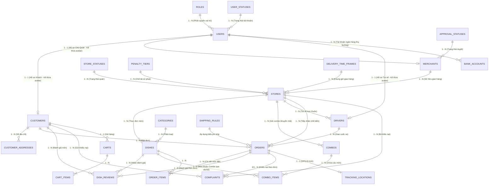

# BÁO CÁO PHÂN TÍCH VÀ THIẾT KẾ CƠ SỞ DỮ LIỆU (CSDL)
## HỆ THỐNG GIAO ĐỒ ĂN TRỰC TUYẾN OISHI FOOD (4 ACTORS)
*(Tài liệu phục vụ Báo cáo Chuyên đề / Đồ án Tốt nghiệp & Hướng dẫn Vận hành Firebase Realtime Database)*

---

## MỤC LỤC
1. [Tổng Quan Hệ Thống & 4 Nhóm Tác Nhân (Actors)](#1-tổng-quan-hệ-thống--4-nhóm-tác-nhân-actors)
2. [Mô Hình Thực Thể Quan Hệ (ERD - Entity Relationship Diagram)](#2-mô-hình-thực-thể-quan-hệ-erd)
3. [Từ Điển Dữ Liệu SQL Chi Tiết (24 Bảng Nghiệp Vụ)](#3-từ-điển-dữ-liệu-sql-chi-tiết-24-bảng)
4. [Kiến Trúc Triển Khai Firebase Realtime Database (NoSQL)](#4-kiến-trúc-triển-khai-firebase-realtime-database-nosql)
5. [Cơ Chế Bảo Mật & Phân Quyền (Firebase Security Rules)](#5-cơ-chế-bảo-mật--phân-quyền-firebase-security-rules)
6. [Dữ Liệu Mẫu Môi Trường Mẫu (Sample JSON Data)](#6-dữ-liệu-mẫu-môi-trường-mẫu-sample-json-data)
7. [Các Cơ Chế Nghiệp Vụ Đặc Thù](#7-các-cơ-chế-nghiệp-vụ-đặc-thù)

---

## 1. TỔNG QUAN HỆ THỐNG & 4 NHÓM TÁC NHÂN (ACTORS)

Hệ thống **Oishi Food** vận hành đồng bộ trên **4 nhóm tác nhân (Actors)**:

| Tác nhân (Actor) | Ứng dụng phụ trách | Quyền hạn & Nghiệp vụ cốt lõi |
| :--- | :--- | :--- |
| **Quản trị viên (`ADMIN`)** | Admin Web Portal / Core | Duyệt hồ sơ quán mới đăng ký (đối chiếu CCCD 4 ảnh), áp chế tài xử phạt khiếu nại (3 mức: Cảnh cáo `WARN`, Ẩn món `HIDE`, Khóa quán `LOCK`), kiểm soát điểm uy tín của khách hàng, xem đánh giá món ăn & gian hàng, giám sát biểu phí ship. Được xác thực trực tiếp qua `users.role == 'ADMIN'`. |
| **Khách hàng (`CUSTOMER`)** | `app-customer` (Android) | Đăng ký/đăng nhập, duyệt menu theo quán, giỏ hàng, đặt đơn, chọn địa chỉ nhận hàng, thanh toán COD/Momo/Banking, xem trạng thái đơn, theo dõi lộ trình tài xế thời gian thực, **đánh giá món ăn**, khiếu nại. Khởi tạo **Điểm uy tín (`trust_score`) = 0** (hoàn tất đơn cộng điểm, bom hàng reset về 0, lưu nhật ký `trust_score_logs`). |
| **Cửa hàng / Đối tác (`MERCHANT`)** | `app-internal` (Android Quán) | Quản lý gian hàng (4 trạng thái: `PENDING`, `OPEN`, `LOCKED`, `CLOSED`), hồ sơ CCCD 4 ảnh, quản lý thực đơn món ăn & combo (gồm các `dishId`), tiếp nhận đơn hàng (Kanban Board), điều phối tài xế nội bộ (`TX-19`, `TX-14`...). |
| **Tài xế giao hàng (`DRIVER`)** | `app-internal` (Android Ship) | Bật/tắt ca trực (`AVAILABLE`, `DELIVERING`, `OFF_DUTY`), nhận đơn, cập nhật tọa độ GPS lộ trình thời gian thực, xác thực hoàn tất giao hàng bằng **Delivery Token QR Code**, báo cáo sự cố boom hàng. |

> **CÁC NGUYÊN TẮC CẢI TIẾN CẤU TRÚC DỮ LIỆU ĐÃ ÁP DỤNG:**
> 1. **Xác thực Quản Trị Viên trực tiếp qua `users` & `roles`:** Actor ADMIN được định danh thông qua vai trò `ADMIN` (`role_id` liên kết `roles`), không cần bảng thực thể con riêng biệt, tối ưu hóa kiến trúc.
> 2. **Bảng Tài Xế (`drivers`) riêng biệt:** Chuẩn hóa hồ sơ riêng cho Actor DRIVER (mã tài xế `driver_code`, CCCD `cccd_number`, GPLX `license_number`, loại xe `vehicle_type`, biển số `vehicle_plate`, tọa độ GPS và ca trực).
> 3. **Tách riêng Chủ Quán (`merchants`) & Cửa Hàng (`stores`):** Chuẩn hóa quan hệ 1 - N (`merchants` → `stores`). Hồ sơ pháp lý CCCD 4 ảnh & giấy phép thuộc `merchants`, thông tin thương hiệu & hoạt động kinh doanh thuộc `stores`.
> 4. **Mô hình 3 Actors chuyên biệt kế thừa từ `users`:** 3 nhóm tác nhân có nghiệp vụ mở rộng (`customers`, `merchants`, `drivers`) đều có bảng hồ sơ thực thể chuyên biệt liên kết khóa ngoại 1-1 với bảng trung tâm `users`.
> 5. **Ảnh đại diện (`avatarUrl`) là thuộc tính dùng chung:** Nằm tại bảng trung tâm `users`, được liên kết dùng chung cho cả 4 Actors.
> 6. **Hợp nhất địa chỉ:** Bỏ phân tách các trường quận, huyện; địa chỉ được lưu trữ dưới dạng một chuỗi địa chỉ thống nhất (`address` / `streetAddress`).
> 7. **Hệ thống đánh giá món ăn riêng biệt:** Bổ sung thực thể `dish_reviews` và tích hợp `ratingAvg`, `reviewCount` trực tiếp vào từng món ăn.
> 8. **Gói Combo liên kết ID món ăn:** Thực thể `Combo` chứa danh sách ID món ăn cụ thể (`dishIds` và mảng chi tiết `items: [{dishId, quantity}]`).
> 9. **Tách riêng Bảng Tài Khoản Ngân Hàng (`bank_accounts`):** Lưu trữ thông tin tài khoản ngân hàng thụ hưởng nhận thanh toán doanh thu/thù lao độc lập, liên kết `user_id`.
> 10. **Tách riêng Bảng Trạng Thái Xét Duyệt (`approval_statuses`):** Chuẩn hóa danh mục trạng thái xét duyệt hồ sơ đối tác (`PENDING`, `APPROVED`, `REJECTED`) bằng bảng độc lập, chuẩn hóa khóa ngoại tham chiếu.
> 11. **Tách riêng Bảng Trạng Thái Gian Hàng (`store_statuses`):** Chuẩn hóa danh mục trạng thái hoạt động của gian hàng (`PENDING`, `OPEN`, `CLOSED`, `LOCKED`).
> 12. **Tách riêng Bảng Chế Tài Xử Phạt (`penalty_tiers`):** Chuẩn hóa các cấp độ chế tài vi phạm quán ăn (`NONE`, `WARN`, `HIDE`, `LOCK`).
> 13. **Tách riêng Bảng Khung Thời Gian Giao Hàng (`delivery_time_frames`):** Chuẩn hóa danh mục khung giờ giao hàng dự kiến (`15-25 phút`, `20-30 phút`, `25-35 phút`, `30-45 phút`) thành bảng độc lập, liên kết khóa ngoại `delivery_time_frame_id` trong `stores`.

---

## 2. MÔ HÌNH THỰC THỂ QUAN HỆ (ERD)



---

## 3. TỪ ĐIỂN DỮ LIỆU SQL CHI TIẾT (20 BẢNG)

### 3.1. Bảng 1: `roles` (Vai trò người dùng hệ thống - RBAC)
*Quản lý danh mục vai trò và quyền hạn cho 4 tác nhân.*

| Tên Cột | Kiểu Dữ Liệu | Ràng Buộc | Ý Nghĩa / Mô Tả |
| :--- | :--- | :--- | :--- |
| `role_id` | INT | PRIMARY KEY, AUTO_INCREMENT | Mã vai trò (1: ADMIN, 2: CUSTOMER, 3: MERCHANT, 4: DRIVER) |
| `role_code` | VARCHAR(20) | NOT NULL, UNIQUE | Mã code nhận diện (`ADMIN`, `CUSTOMER`, `MERCHANT`, `DRIVER`) |
| `role_name` | VARCHAR(50) | NOT NULL | Tên vai trò hiển thị (Quản trị viên, Khách hàng, Quán, Tài xế) |
| `description` | VARCHAR(255) | NULL | Diễn giải quyền hạn |
| `created_at` | DATETIME | DEFAULT CURRENT_TIMESTAMP | Thời điểm khởi tạo |

---

### 3.2. Bảng 2: `user_statuses` (Trạng thái hoạt động tài khoản)
*Quản lý trạng thái hoạt động, đăng nhập/đăng xuất của người dùng.*

| Tên Cột | Kiểu Dữ Liệu | Ràng Buộc | Ý Nghĩa / Mô Tả |
| :--- | :--- | :--- | :--- |
| `status_id` | INT | PRIMARY KEY, AUTO_INCREMENT | Mã trạng thái (1: ACTIVE, 2: INACTIVE, 3: OFFLINE) |
| `status_code` | VARCHAR(20) | NOT NULL, UNIQUE | Mã định danh trạng thái (`ACTIVE`, `INACTIVE`, `OFFLINE`) |
| `status_name` | VARCHAR(50) | NOT NULL | Tên trạng thái (Đang hoạt động, Ngưng hoạt động, Ngoại tuyến) |
| `description` | VARCHAR(255) | NULL | Ý nghĩa trạng thái |
| `created_at` | DATETIME | DEFAULT CURRENT_TIMESTAMP | Thời điểm khởi tạo |

---

### 3.3. Bảng 3: `users` (Tài khoản người dùng & Ảnh đại diện chung)
*Lưu trữ định danh, thông tin xác thực và ảnh đại diện dùng chung cho tất cả các Actors. Actor ADMIN được định danh trực tiếp qua vai trò `role_id = 1`.*

| Tên Cột | Kiểu Dữ Liệu | Ràng Buộc | Ý Nghĩa / Mô Tả |
| :--- | :--- | :--- | :--- |
| `user_id` | VARCHAR(64) | PRIMARY KEY | Khóa chính duy nhất (Khớp Firebase Auth UID) |
| `role_id` | INT | NOT NULL, FK(`roles.role_id`)| **Liên kết vai trò tài khoản** |
| `status_id` | INT | NOT NULL, DEFAULT 1, FK(`user_statuses.status_id`)| **Liên kết trạng thái tài khoản** |
| `phone_number` | VARCHAR(15) | NOT NULL | Số điện thoại liên hệ đăng nhập |
| `password_hash`| VARCHAR(255) | NOT NULL | Chuỗi băm mật khẩu bảo mật |
| `full_name` | VARCHAR(100) | NOT NULL | Họ và tên hiển thị |
| `email` | VARCHAR(100) | UNIQUE, NULL | Địa chỉ email liên lạc |
| `avatar_url` | VARCHAR(255) | NULL | **Ảnh đại diện dùng chung (Admin, Customer, Quán, Shipper)** |
| `fcm_token` | TEXT | NULL | Token Firebase Cloud Messaging nhận thông báo đẩy |
| `created_at` | DATETIME | DEFAULT CURRENT_TIMESTAMP | Thời điểm đăng ký tài khoản |

---

### 3.4. Bảng 4: `customers` (Hồ sơ khách hàng & Điểm Uy Tín)
*Quản lý điểm tín nhiệm phòng chống boom hàng (ảnh đại diện liên kết trực tiếp từ bảng `users`).*

| Tên Cột | Kiểu Dữ Liệu | Ràng Buộc | Ý Nghĩa / Mô Tả |
| :--- | :--- | :--- | :--- |
| `user_id` | VARCHAR(64) | PRIMARY KEY, FK(`users.user_id`) | Khóa chính liên kết `users` |
| `trust_score` | INT | DEFAULT 0, CHECK(>= 0) | **Điểm uy tín** (Khởi tạo 0 điểm, giao thành công cộng điểm, bom hàng reset về 0) |
| `total_orders` | INT | DEFAULT 0 | Tổng số đơn hàng đã đặt trên hệ thống |
| `completed_orders`| INT | DEFAULT 0 | Số đơn hàng đã nhận thành công |
| `boom_orders` | INT | DEFAULT 0 | Số lần từ chối nhận hàng không lý do |

---

### 3.5. Bảng 5: `customer_addresses` (Sổ địa chỉ nhận hàng)
*Danh bạ địa chỉ giao hàng (sử dụng chuỗi địa chỉ thống nhất, không chia tách quận huyện).*

| Tên Cột | Kiểu Dữ Liệu | Ràng Buộc | Ý Nghĩa / Mô Tả |
| :--- | :--- | :--- | :--- |
| `address_id` | BIGINT | PRIMARY KEY, AUTO_INCREMENT | Mã địa chỉ |
| `user_id` | VARCHAR(64) | FK(`customers.user_id`) | Khách hàng sở hữu |
| `receiver_name`| VARCHAR(100) | NOT NULL | Tên người nhận tại điểm giao |
| `receiver_phone`| VARCHAR(15)| NOT NULL | Số điện thoại người nhận |
| `street_address`| VARCHAR(255)| NOT NULL | **Địa chỉ nhận hàng đầy đủ** (Số nhà, tên đường, khu vực) |
| `latitude` | DECIMAL(10,8)| NULL | Tọa độ GPS vĩ độ |
| `longitude` | DECIMAL(11,8)| NULL | Tọa độ GPS kinh độ |
| `is_default` | BOOLEAN | DEFAULT FALSE | Đánh dấu địa chỉ nhận mặc định |

---

### 3.6. Bảng 6: `merchants` (Hồ sơ chủ cửa hàng / Đối tác - Actor MERCHANT)
*Thông tin định danh và hồ sơ pháp lý CCCD của Chủ quán để Admin xét duyệt.*

| Tên Cột | Kiểu Dữ Liệu | Ràng Buộc | Ý Nghĩa / Mô Tả |
| :--- | :--- | :--- | :--- |
| `user_id` | VARCHAR(64) | PRIMARY KEY, FK(`users.user_id`) | Khóa chính liên kết `users` (Actor MERCHANT) |
| `cccd_number` | VARCHAR(20) | NOT NULL | Số Căn cước công dân của chủ quán |
| `cccd_front_url`| VARCHAR(255)| NOT NULL | Ảnh mặt trước CCCD |
| `cccd_back_url` | VARCHAR(255)| NOT NULL | Ảnh mặt sau CCCD |
| `cccd_hold_url` | VARCHAR(255)| NOT NULL | Ảnh chân dung cầm CCCD trên tay |
| `cccd_portrait_url`| VARCHAR(255)| NULL | Ảnh chân dung đối chiếu |
| `business_license`| VARCHAR(255)| NULL | Ảnh Giấy phép ĐKKD / Vệ sinh ATTP |
| `tax_code` | VARCHAR(20) | NULL | Mã số thuế hộ kinh doanh / doanh nghiệp |
| `approval_status_id`| INT | NOT NULL, DEFAULT 1, FK(`approval_statuses.status_id`) | **Khóa ngoại liên kết bảng trạng thái xét duyệt hồ sơ** |
| `created_at` | DATETIME | DEFAULT CURRENT_TIMESTAMP | Thời điểm nộp hồ sơ |

---

### 3.7. Bảng 7: `approval_statuses` (Trạng thái xét duyệt hồ sơ đối tác)
*Danh mục chuẩn hóa trạng thái kiểm duyệt hồ sơ đối tác (Merchant/Driver) của Quản trị viên.*

| Tên Cột | Kiểu Dữ Liệu | Ràng Buộc | Ý Nghĩa / Mô Tả |
| :--- | :--- | :--- | :--- |
| `status_id` | INT | PRIMARY KEY, AUTO_INCREMENT | Mã định danh trạng thái xét duyệt (1: PENDING, 2: APPROVED, 3: REJECTED) |
| `status_code` | VARCHAR(20) | NOT NULL, UNIQUE | Mã định danh (`PENDING`, `APPROVED`, `REJECTED`) |
| `status_name` | VARCHAR(50) | NOT NULL | Tên trạng thái hiển thị (Chờ duyệt, Đã duyệt, Từ chối) |
| `description` | VARCHAR(255) | NULL | Ý nghĩa trạng thái xét duyệt |
| `created_at` | DATETIME | DEFAULT CURRENT_TIMESTAMP | Thời điểm khởi tạo |

---

### 3.8. Bảng 8: `bank_accounts` (Tài khoản ngân hàng thụ hưởng)
*Lưu trữ thông tin tài khoản ngân hàng nhận thanh toán doanh thu của chủ quán, thù lao tài xế.*

| Tên Cột | Kiểu Dữ Liệu | Ràng Buộc | Ý Nghĩa / Mô Tả |
| :--- | :--- | :--- | :--- |
| `bank_account_id` | BIGINT | PRIMARY KEY, AUTO_INCREMENT | Mã tài khoản ngân hàng |
| `user_id` | VARCHAR(64) | NOT NULL, FK(`users.user_id`) | Khóa ngoại liên kết tài khoản người dùng (`merchants`, `drivers`) |
| `bank_name` | VARCHAR(100) | NOT NULL | Tên ngân hàng nhận thanh toán doanh thu |
| `account_number` | VARCHAR(30) | NOT NULL | **Số tài khoản ngân hàng thụ hưởng** |
| `account_holder_name`| VARCHAR(100) | NOT NULL | Họ và tên chủ tài khoản thụ hưởng |
| `branch_name` | VARCHAR(100) | NULL | Chi nhánh mở tài khoản ngân hàng |
| `is_default` | BOOLEAN | DEFAULT TRUE | Đặt làm tài khoản nhận thanh toán mặc định |
| `created_at` | DATETIME | DEFAULT CURRENT_TIMESTAMP | Thời điểm thêm tài khoản |

---

### 3.9. Bảng 9: `store_statuses` (Trạng thái hoạt động gian hàng)
*Danh mục chuẩn hóa trạng thái kinh doanh của gian hàng trên ứng dụng.*

| Tên Cột | Kiểu Dữ Liệu | Ràng Buộc | Ý Nghĩa / Mô Tả |
| :--- | :--- | :--- | :--- |
| `status_id` | INT | PRIMARY KEY, AUTO_INCREMENT | Mã định danh trạng thái gian hàng (1: PENDING, 2: OPEN, 3: CLOSED, 4: LOCKED) |
| `status_code` | VARCHAR(20) | NOT NULL, UNIQUE | Mã định danh (`PENDING`, `OPEN`, `CLOSED`, `LOCKED`) |
| `status_name` | VARCHAR(50) | NOT NULL | Tên trạng thái hiển thị (Chờ duyệt, Đang mở cửa, Đang đóng cửa, Bị khóa) |
| `description` | VARCHAR(255) | NULL | Diễn giải ý nghĩa trạng thái |
| `created_at` | DATETIME | DEFAULT CURRENT_TIMESTAMP | Thời điểm khởi tạo |

---

### 3.10. Bảng 10: `penalty_tiers` (Cấp độ chế tài xử phạt quán ăn)
*Danh mục chế tài xử phạt do Quản trị viên áp dụng khi giải quyết khiếu nại.*

| Tên Cột | Kiểu Dữ Liệu | Ràng Buộc | Ý Nghĩa / Mô Tả |
| :--- | :--- | :--- | :--- |
| `tier_id` | INT | PRIMARY KEY, AUTO_INCREMENT | Mã định danh cấp độ phạt (1: NONE, 2: WARN, 3: HIDE, 4: LOCK) |
| `tier_code` | VARCHAR(20) | NOT NULL, UNIQUE | Mã cấp độ (`NONE`, `WARN`, `HIDE`, `LOCK`) |
| `tier_name` | VARCHAR(50) | NOT NULL | Tên mức phạt hiển thị (Không phạt, Cảnh cáo, Ẩn món/quán, Khóa quán) |
| `description` | VARCHAR(255) | NULL | Chi tiết quy định áp dụng chế tài |
| `created_at` | DATETIME | DEFAULT CURRENT_TIMESTAMP | Thời điểm khởi tạo |

---

### 3.11. Bảng 11: `delivery_time_frames` (Khung thời gian giao hàng dự kiến)
*Danh mục chuẩn hóa khung thời gian giao hàng dự kiến của quán ăn.*

| Tên Cột | Kiểu Dữ Liệu | Ràng Buộc | Ý Nghĩa / Mô Tả |
| :--- | :--- | :--- | :--- |
| `frame_id` | INT | PRIMARY KEY, AUTO_INCREMENT | Mã định danh khung giờ (1: 15-25MIN, 2: 20-30MIN, 3: 25-35MIN, 4: 30-45MIN) |
| `frame_code` | VARCHAR(20) | NOT NULL, UNIQUE | Mã định danh (`15-25MIN`, `20-30MIN`, `25-35MIN`, `30-45MIN`) |
| `display_text` | VARCHAR(50) | NOT NULL | Chuỗi hiển thị (`15-25 phút`, `20-30 phút`, `25-35 phút`, `30-45 phút`) |
| `min_minutes` | INT | NOT NULL | Thời gian tối thiểu (phút) |
| `max_minutes` | INT | NOT NULL | Thời gian tối đa (phút) |
| `is_active` | BOOLEAN | DEFAULT TRUE | Trạng thái áp dụng |
| `created_at` | DATETIME | DEFAULT CURRENT_TIMESTAMP | Thời điểm khởi tạo |

---

### 3.12. Bảng 12: `stores` (Gian hàng cửa hàng / Quán ăn)
*Quản lý gian hàng kinh doanh trên ứng dụng (thuộc sở hữu của Chủ quán `merchants`).*

| Tên Cột | Kiểu Dữ Liệu | Ràng Buộc | Ý Nghĩa / Mô Tả |
| :--- | :--- | :--- | :--- |
| `store_id` | VARCHAR(64) | PRIMARY KEY | Mã định danh cửa hàng (Khớp UID hoặc shop_id) |
| `merchant_id` | VARCHAR(64) | FK(`merchants.user_id`)| **Chủ sở hữu quán** |
| `store_name` | VARCHAR(150) | NOT NULL | Tên thương hiệu quán ăn |
| `store_phone` | VARCHAR(15) | NOT NULL | Số hotline của quán |
| `address` | VARCHAR(255) | NOT NULL | **Địa chỉ quán đầy đủ** (không tách quận huyện) |
| `latitude` | DECIMAL(10,8)| DEFAULT 10.7769 | Tọa độ vĩ độ định vị quán |
| `longitude` | DECIMAL(11,8)| DEFAULT 106.7009 | Tọa độ kinh độ định vị quán |
| `image_url` | TEXT | NULL | Ảnh biển hiệu / bìa gian hàng |
| `status_id` | INT | NOT NULL, DEFAULT 1, FK(`store_statuses.status_id`) | **Khóa ngoại trạng thái quán** (1: PENDING, 2: OPEN, 3: CLOSED, 4: LOCKED) |
| `penalty_tier_id`| INT | NOT NULL, DEFAULT 1, FK(`penalty_tiers.tier_id`) | **Khóa ngoại chế tài xử phạt** (1: NONE, 2: WARN, 3: HIDE, 4: LOCK) |
| `penalty_reason`| TEXT | NULL | Lý do xử phạt quán nếu vi phạm |
| `rating_avg` | DECIMAL(2,1) | DEFAULT 5.0 | Điểm đánh giá bình quân của quán |
| `delivery_time_frame_id`| INT | NOT NULL, DEFAULT 2, FK(`delivery_time_frames.frame_id`) | **Khóa ngoại khung thời gian giao hàng dự kiến** |

---

### 3.13. Bảng 13: `drivers` (Hồ sơ tài xế giao hàng - Actor DRIVER)
*Hồ sơ tài xế giao nhận, cập nhật GPS thời gian thực, xác thực OTP/QR giao đơn.*

| Tên Cột | Kiểu Dữ Liệu | Ràng Buộc | Ý Nghĩa / Mô Tả |
| :--- | :--- | :--- | :--- |
| `user_id` | VARCHAR(64) | PRIMARY KEY, FK(`users.user_id`) | Khóa chính liên kết `users` (Actor DRIVER) |
| `store_id` | VARCHAR(64) | NULL, FK(`stores.store_id`) | Quán trực thuộc (hoặc NULL nếu là tài xế nền tảng) |
| `driver_code` | VARCHAR(20) | NOT NULL, UNIQUE | Mã tài xế (Ví dụ: `TX-19`, `TX-14`, `TX-08`) |
| `cccd_number` | VARCHAR(20) | NOT NULL | Số Căn cước công dân (12 số) |
| `cccd_front_url`| VARCHAR(255)| NULL | Ảnh mặt trước CCCD |
| `cccd_back_url` | VARCHAR(255)| NULL | Ảnh mặt sau CCCD |
| `license_number`| VARCHAR(30) | NULL | Số Giấy phép lái xe / GPLX A1, A2 |
| `vehicle_type`| VARCHAR(50) | DEFAULT 'MOTORBIKE' | Loại phương tiện (Xe máy số, tay ga, xe điện) |
| `vehicle_plate`| VARCHAR(20) | NOT NULL | Biển kiểm soát xe giao hàng |
| `rating_avg` | DECIMAL(2,1) | DEFAULT 5.0 | Điểm sao phục vụ |
| `duty_status` | ENUM | DEFAULT 'OFF_DUTY' | `AVAILABLE`, `DELIVERING`, `OFF_DUTY` |
| `current_lat` | DECIMAL(10,8)| NULL | Tọa độ GPS vĩ độ thời gian thực |
| `current_lng` | DECIMAL(11,8)| NULL | Tọa độ GPS kinh độ thời gian thực |
| `created_at` | DATETIME | DEFAULT CURRENT_TIMESTAMP | Thời điểm kích hoạt tài xế |

---

### 3.14. Bảng 14: `categories` (Danh mục ẩm thực)
*Phân loại ẩm thực toàn hệ thống.*

| Tên Cột | Kiểu Dữ Liệu | Ràng Buộc | Ý Nghĩa / Mô Tả |
| :--- | :--- | :--- | :--- |
| `category_id` | VARCHAR(32) | PRIMARY KEY | Mã danh mục |
| `name` | VARCHAR(100) | NOT NULL, UNIQUE | Tên danh mục hiển thị (Cơm, Phở, Trà sữa...) |
| `icon_url` | VARCHAR(255) | NULL | Biểu tượng icon/emoji minh họa |
| `display_order`| INT | DEFAULT 0 | Thứ tự hiển thị ưu tiên |
| `is_active` | BOOLEAN | DEFAULT TRUE | Trạng thái kích hoạt |

---

### 3.15. Bảng 15: `dishes` (Món ăn trong thực đơn)
*Món ăn do quán trực tiếp đăng bán kèm điểm đánh giá sao trung bình.*

| Tên Cột | Kiểu Dữ Liệu | Ràng Buộc | Ý Nghĩa / Mô Tả |
| :--- | :--- | :--- | :--- |
| `dish_id` | VARCHAR(64) | PRIMARY KEY | Mã món ăn duy nhất |
| `store_id` | VARCHAR(64) | FK(`stores.store_id`) | Quán sở hữu món |
| `category_id` | VARCHAR(32) | FK(`categories.category_id`) | Danh mục món |
| `dish_name` | VARCHAR(150) | NOT NULL | Tên món ăn |
| `description` | TEXT | NULL | Mô tả chi tiết món |
| `image_url` | VARCHAR(255) | NULL | Hình ảnh minh họa |
| `base_price` | DECIMAL(12,0)| NOT NULL, CHECK(>= 0) | Đơn giá niêm yết (VNĐ) |
| `is_available`| BOOLEAN | DEFAULT TRUE | Tình trạng còn hàng |
| `is_hidden` | BOOLEAN | DEFAULT FALSE | Bị ẩn bởi quán hoặc do chế tài `HIDE` |
| `sold_count` | INT | DEFAULT 0 | Lũy kế số lượng đã bán |
| `rating_avg` | DECIMAL(2,1) | DEFAULT 5.0 | **Điểm đánh giá trung bình của món** (⭐ 1.0 - 5.0) |
| `review_count`| INT | DEFAULT 0 | **Tổng lượt đánh giá món ăn** |

---

### 3.16. Bảng 16: `combos` (Gói Combo Khuyến Mãi)
*Tập hợp nhiều món ăn bán chung, liên kết cụ thể qua `dish_id`.*

| Tên Cột | Kiểu Dữ Liệu | Ràng Buộc | Ý Nghĩa / Mô Tả |
| :--- | :--- | :--- | :--- |
| `combo_id` | VARCHAR(64) | PRIMARY KEY | Mã combo |
| `store_id` | VARCHAR(64) | FK(`stores.store_id`) | Quán sở hữu combo |
| `combo_name` | VARCHAR(150) | NOT NULL | Tên combo |
| `description` | TEXT | NULL | Mô tả chi tiết combo |
| `combo_price` | DECIMAL(12,0)| NOT NULL | Đơn giá combo |
| `image_url` | VARCHAR(255) | NULL | Ảnh combo |
| `is_active` | BOOLEAN | DEFAULT TRUE | Đang bán hay tạm dừng |

---

### 3.17. Bảng 17: `combo_items` (Món thành phần trong Combo)
*Chi tiết các món ăn nằm trong gói Combo qua mã món `dish_id`.*

| Tên Cột | Kiểu Dữ Liệu | Ràng Buộc | Ý Nghĩa / Mô Tả |
| :--- | :--- | :--- | :--- |
| `combo_item_id` | BIGINT | PRIMARY KEY, AUTO_INCREMENT | Mã món thành phần |
| `combo_id` | VARCHAR(64) | FK(`combos.combo_id`) | Thuộc gói combo nào |
| `dish_id` | VARCHAR(64) | FK(`dishes.dish_id`) | **Món ăn cụ thể được thêm vào combo** |
| `quantity` | INT | NOT NULL, DEFAULT 1 | Số lượng món |

---

### 3.18. Bảng 18: `shipping_rules` (Cấu hình biểu phí vận chuyển)
*Biểu phí vận chuyển tính theo cự ly khoảng cách.*

| Tên Cột | Kiểu Dữ Liệu | Ràng Buộc | Ý Nghĩa / Mô Tả |
| :--- | :--- | :--- | :--- |
| `rule_id` | INT | PRIMARY KEY, AUTO_INCREMENT | Mã quy tắc |
| `from_km` | DECIMAL(4,1)| NOT NULL | Từ khoảng cách (km) |
| `to_km` | DECIMAL(4,1)| NOT NULL | Đến khoảng cách (km) |
| `base_fee` | DECIMAL(12,0)| NOT NULL | Mức phí giao áp dụng (VNĐ) |
| `is_active` | BOOLEAN | DEFAULT TRUE | Hiệu lực áp dụng |

---

### 3.19. Bảng 19: `orders` (Đơn hàng)
*Quản lý vòng đời đơn hàng.*

| Tên Cột | Kiểu Dữ Liệu | Ràng Buộc | Ý Nghĩa / Mô Tả |
| :--- | :--- | :--- | :--- |
| `order_id` | VARCHAR(64) | PRIMARY KEY | Mã đơn hàng (Khớp Firebase key) |
| `customer_id` | VARCHAR(64) | FK(`customers.user_id`) | Khách hàng đặt đơn |
| `store_id` | VARCHAR(64) | FK(`stores.store_id`) | Quán tiếp nhận chế biến |
| `driver_id` | VARCHAR(64) | NULL, FK(`drivers.user_id`)| Tài xế được gán đơn |
| `status` | ENUM | NOT NULL | `PENDING` → `CONFIRMED` → `PREPARING` → `DELIVERING` → `COMPLETED` / `CANCELLED` |
| `subtotal_amount`| DECIMAL(12,0)| NOT NULL | Tiền món ăn |
| `shipping_fee`| DECIMAL(12,0)| NOT NULL | Phí vận chuyển |
| `total_amount`| DECIMAL(12,0)| NOT NULL | Tổng thanh toán = Món + Ship |
| `payment_method`| ENUM | NOT NULL | `COD` (Tiền mặt), `MOMO` (Ví điện tử), `BANKING` (Chuyển khoản ngân hàng) |
| `delivery_address`| VARCHAR(255)| NOT NULL | Địa chỉ nhận hàng chi tiết |
| `delivery_token`| VARCHAR(6) | NOT NULL | **Mã OTP/QR xác thực giao hàng 6 số** |
| `created_at` | BIGINT | NOT NULL | Thời điểm đặt (Epoch milliseconds) |

---

### 3.20. Bảng 20: `order_items` (Chi tiết món trong đơn)
*Lưu vết đơn giá món ăn tại thời điểm mua.*

| Tên Cột | Kiểu Dữ Liệu | Ràng Buộc | Ý Nghĩa / Mô Tả |
| :--- | :--- | :--- | :--- |
| `item_id` | BIGINT | PRIMARY KEY, AUTO_INCREMENT | Mã chi tiết món |
| `order_id` | VARCHAR(64) | FK(`orders.order_id`) | Thuộc đơn hàng nào |
| `dish_id` | VARCHAR(64) | FK(`dishes.dish_id`) | Mã món ăn gốc |
| `dish_name` | VARCHAR(150) | NOT NULL | Tên món lúc đặt |
| `unit_price` | DECIMAL(12,0)| NOT NULL | Đơn giá lúc mua |
| `quantity` | INT | NOT NULL, CHECK(> 0) | Số lượng mua |
| `subtotal` | DECIMAL(12,0)| NOT NULL | Thành tiền = Đơn giá × Số lượng |

---

### 3.21. Bảng 21: `complaints` (Khiếu nại & Tranh chấp)
*Xử lý khiếu nại chất lượng dịch vụ của quán.*

| Tên Cột | Kiểu Dữ Liệu | Ràng Buộc | Ý Nghĩa / Mô Tả |
| :--- | :--- | :--- | :--- |
| `complaint_id`| VARCHAR(64) | PRIMARY KEY | Mã khiếu nại |
| `order_id` | VARCHAR(64) | FK(`orders.order_id`) | Đơn hàng phát sinh khiếu nại |
| `customer_id` | VARCHAR(64) | FK(`customers.user_id`) | Người gửi khiếu nại |
| `store_id` | VARCHAR(64) | FK(`stores.store_id`) | Quán bị khiếu nại |
| `content` | TEXT | NOT NULL | Nội dung chi tiết phản ánh |
| `status` | ENUM | DEFAULT 'PENDING' | `PENDING`, `RESOLVED`, `REJECTED` |
| `penalty_applied`| ENUM | DEFAULT 'NONE' | Mức phạt: `NONE`, `WARN`, `HIDE`, `LOCK` |
| `created_at` | BIGINT | NOT NULL | Thời điểm gửi |

---

### 3.22. Bảng 22: `tracking_locations` (Theo dõi lộ trình tài xế)
*Tọa độ GPS định vị di chuyển thời gian thực của Shipper khi đang giao hàng.*

| Tên Cột | Kiểu Dữ Liệu | Ràng Buộc | Ý Nghĩa / Mô Tả |
| :--- | :--- | :--- | :--- |
| `tracking_id` | BIGINT | PRIMARY KEY, AUTO_INCREMENT | Mã ghi nhận |
| `order_id` | VARCHAR(64) | FK(`orders.order_id`) | Đơn hàng đang theo dõi |
| `driver_id` | VARCHAR(64) | FK(`drivers.user_id`) | Tài xế thực hiện đơn |
| `latitude` | DECIMAL(10,8)| NOT NULL | Vĩ độ hiện thời |
| `longitude` | DECIMAL(11,8)| NOT NULL | Kinh độ hiện thời |
| `updated_at` | BIGINT | NOT NULL | Thời điểm ghi nhận (Epoch ms) |

---

### 3.23. Bảng 23: `dish_reviews` (Đánh giá món ăn)
*Khách hàng đánh giá số sao (1-5 ⭐) và nhận xét chi tiết cho từng món ăn sau khi nhận đơn.*

| Tên Cột | Kiểu Dữ Liệu | Ràng Buộc | Ý Nghĩa / Mô Tả |
| :--- | :--- | :--- | :--- |
| `review_id` | VARCHAR(64) | PRIMARY KEY | Mã đánh giá duy nhất |
| `order_id` | VARCHAR(64) | FK(`orders.order_id`) | Đơn hàng đã hoàn tất |
| `dish_id` | VARCHAR(64) | FK(`dishes.dish_id`) | **Món ăn được đánh giá** |
| `customer_id` | VARCHAR(64) | FK(`customers.user_id`) | Khách hàng thực hiện đánh giá |
| `rating` | INT | NOT NULL, CHECK(1..5) | **Số sao đánh giá (1 đến 5 sao)** |
| `comment` | TEXT | NULL | Nội dung nhận xét, cảm nhận món ăn |
| `image_url` | VARCHAR(255)| NULL | Hình ảnh chụp món thực tế nhận được |
| `created_at` | BIGINT | NOT NULL | Thời điểm đánh giá (Epoch ms) |

---

### 3.24. Bảng 24: `trust_score_logs` (Lịch sử biến động điểm uy tín khách hàng)
*Lưu vết lịch sử cộng/trừ điểm uy tín khách hàng (giao thành công cộng điểm, bom hàng reset về 0).*

| Tên Cột | Kiểu Dữ Liệu | Ràng Buộc | Ý Nghĩa / Mô Tả |
| :--- | :--- | :--- | :--- |
| `log_id` | BIGINT | PRIMARY KEY, AUTO_INCREMENT | Mã nhật ký ghi nhận biến động điểm |
| `user_id` | VARCHAR(64) | FK(`customers.user_id`) | Khách hàng nhận biến động |
| `order_id` | VARCHAR(64) | NULL, FK(`orders.order_id`) | Đơn hàng phát sinh biến động (nếu có) |
| `change_amount` | INT | NOT NULL | Số điểm thay đổi (VD: `+1` khi giao thành công, reset về `0` khi bom hàng) |
| `old_score` | INT | NOT NULL | Điểm uy tín trước biến động |
| `new_score` | INT | NOT NULL | Điểm uy tín sau biến động |
| `reason` | VARCHAR(255) | NOT NULL | Lý do (`Hoàn thành đơn hàng`, `Từ chối nhận hàng / Bom hàng`) |
| `created_at` | DATETIME | DEFAULT CURRENT_TIMESTAMP | Thời điểm ghi nhận |

---

## 4. KIẾN TRÚC TRIỂN KHAI FIREBASE REALTIME DATABASE (NOSQL)

Hệ thống sử dụng **Firebase Realtime Database (RTDB)** làm cơ sở dữ liệu phân tán chính cho cả 2 ứng dụng Android (`app-customer` và `app-internal`) và Admin Web:

```text
https://chuyen-de-2-2f0bc-default-rtdb.asia-southeast1.firebasedatabase.app/
│
├── roles/                     # [Bảng 1] Danh mục vai trò hệ thống (RBAC)
│   ├── ROLE_ADMIN/            # (code: "ADMIN", name: "Quản trị viên", description: "...")
│   ├── ROLE_CUSTOMER/         # (code: "CUSTOMER", name: "Khách hàng", description: "...")
│   ├── ROLE_MERCHANT/         # (code: "MERCHANT", name: "Chủ cửa hàng", description: "...")
│   └── ROLE_DRIVER/           # (code: "DRIVER", name: "Tài xế giao hàng", description: "...")
│
├── user_statuses/             # [Bảng 2] Danh mục trạng thái tài khoản
│   ├── 1/                     # (code: "ACTIVE", name: "Đang hoạt động")
│   ├── 2/                     # (code: "INACTIVE", name: "Ngưng hoạt động")
│   └── 3/                     # (code: "OFFLINE", name: "Ngoại tuyến")
│
├── users/                     # [Bảng 3] Tài khoản & Ảnh đại diện chung avatarUrl (Admin xác thực trực tiếp tại đây)
│   └── {userId}/              # (uid, name, email, phone, avatarUrl, role, roleId, status, statusId, fcmToken)
│
├── customers/                 # [Bảng 4] Hồ sơ khách hàng & Thẻ Điểm Uy Tín
│   └── {userId}/              # (userId, trustScore, totalOrders, completedOrders, boomOrders)
│
├── trust_score_logs/          # [Bảng 20] Lịch sử biến động điểm uy tín khách hàng
│   └── {logId}/               # (logId, userId, orderId, changeAmount, oldScore, newScore, reason, createdAt)
│
├── merchants/                 # [Bảng 6] Hồ sơ chủ quán đối tác (CCCD, GPKD)
│   └── {userId}/              # (userId, cccdNumber, cccdFrontUrl, cccdBackUrl, businessLicense, approvalStatusId)
│
├── approval_statuses/         # [Bảng 7] Danh mục trạng thái xét duyệt hồ sơ
│   ├── 1/                     # (code: "PENDING", name: "Chờ duyệt")
│   ├── 2/                     # (code: "APPROVED", name: "Đã duyệt")
│   └── 3/                     # (code: "REJECTED", name: "Từ chối")
│
├── bank_accounts/             # [Bảng 8] Tài khoản ngân hàng thụ hưởng đối tác/người dùng
│   └── {bankAccountId}/       # (bankAccountId, userId, bankName, accountNumber, accountHolderName, branchName, isDefault)
│
├── store_statuses/            # [Bảng 9] Danh mục trạng thái gian hàng
│   ├── 1/                     # (code: "PENDING", name: "Chờ duyệt")
│   ├── 2/                     # (code: "OPEN", name: "Đang mở cửa")
│   ├── 3/                     # (code: "CLOSED", name: "Đang đóng cửa")
│   └── 4/                     # (code: "LOCKED", name: "Bị khóa")
│
├── penalty_tiers/             # [Bảng 10] Danh mục cấp độ chế tài xử phạt quán ăn
│   ├── 1/                     # (code: "NONE", name: "Không phạt")
│   ├── 2/                     # (code: "WARN", name: "Cảnh cáo")
│   ├── 3/                     # (code: "HIDE", name: "Ẩn món/quán")
│   └── 4/                     # (code: "LOCK", name: "Khóa quán")
│
├── stores/                    # [Bảng 12] Hồ sơ gian hàng đối tác kinh doanh (địa chỉ thống nhất)
│   └── {storeId}/             # (id, merchantId, name, phone, address, statusId, penaltyTierId, deliveryTimeFrameId, ratingAvg)
│
├── delivery_time_frames/      # [Bảng 11] Danh mục khung giờ giao hàng dự kiến
│   ├── 1/                     # (code: "15-25MIN", displayText: "15-25 phút", minMinutes: 15, maxMinutes: 25)
│   ├── 2/                     # (code: "20-30MIN", displayText: "20-30 phút", minMinutes: 20, maxMinutes: 30)
│   ├── 3/                     # (code: "25-35MIN", displayText: "25-35 phút", minMinutes: 25, maxMinutes: 35)
│   └── 4/                     # (code: "30-45MIN", displayText: "30-45 phút", minMinutes: 30, maxMinutes: 45)
│
├── drivers/                   # [Bảng 13] Hồ sơ tài xế giao hàng (Driver Actor)
│   └── {userId}/              # (userId, storeId, driverCode, cccdNumber, cccdFrontUrl, cccdBackUrl, licenseNumber, vehicleType, vehiclePlate, dutyStatus, ratingAvg)
│
├── restaurants/               # Alias danh sách quán tương thích UI cũ
│   └── {shopId}/              # (id, name, address, imageUrl, rating, category, isOpen)
│
├── categories/                # [Bảng 14] Danh mục ẩm thực
│   └── {categoryId}/          # (categoryId, name, iconUrl, displayOrder, isActive)
│
├── menus/                     # [Bảng 15] Thực đơn món ăn kèm ratingAvg & reviewCount
│   └── {shopId}/              
│       └── {itemId}/          # (id, name, price, description, imageUrl, ratingAvg, reviewCount)
│
├── combos/                    # [Bảng 16 & 17] Gói combo kèm danh sách ID món ăn
│   └── {comboId}/             # (comboId, storeId, comboName, comboPrice, dishIds[], items[])
│
├── shipping_rules/            # [Bảng 18] Cấu hình biểu phí vận chuyển
│   └── {ruleId}/              # (ruleId, fromKm, toKm, baseFee, isActive)
│
├── orders/                    # [Bảng 19 & 20] Đơn hàng & Chi tiết món
│   └── {orderId}/             # (orderId, customerId, shopId, shipperId, status, totalAmount, deliveryToken)
│
├── complaints/                # [Bảng 21] Đơn khiếu nại chất lượng dịch vụ
│   └── {complaintId}/         # (complaintId, orderId, customerId, storeId, content, status)
│
├── tracking/                  # [Bảng 22] Tọa độ GPS lộ trình trực tuyến thời gian thực
│   └── {orderId}/             # (orderId, driverId, latitude, longitude, updatedAt)
│
├── dish_reviews/              # [Bảng 23] Đánh giá món ăn của khách hàng
│   └── {reviewId}/            # (reviewId, orderId, dishId, customerId, rating, comment, createdAt)
│
├── trust_score_logs/          # [Bảng 24] Lịch sử biến động điểm uy tín khách hàng
│   └── {logId}/               # (logId, userId, orderId, changeAmount, oldScore, newScore, reason, createdAt)
│
├── carts/                     # Giỏ hàng cá nhân hóa theo từng khách hàng
│   └── {userId}/              # (userId, shopId, items[], totalAmount)
```

---

## 5. CƠ CHẾ BẢO MẬT & PHÂN QUYỀN (FIREBASE SECURITY RULES)

Toàn bộ quy tắc bảo mật được cấu hình hoàn chỉnh tại [database.rules.json](file:///e:/Android/Chuyen-De-2/database.rules.json):

```json
{
  "rules": {
    "users": {
      ".indexOn": ["role", "status"],
      ".read": "auth != null",
      "$userId": {
        ".write": "auth != null && (auth.uid == $userId || root.child('users').child(auth.uid).child('role').val() == 'MANAGER' || root.child('users').child(auth.uid).child('role').val() == 'MERCHANT')"
      }
    },
    "customers": {
      ".read": "auth != null",
      "$customerId": {
        ".write": "auth != null && (auth.uid == $customerId || root.child('users').child(auth.uid).child('role').val() == 'ADMIN')"
      }
    },
    "drivers": {
      ".indexOn": ["dutyStatus", "storeId"],
      ".read": "auth != null",
      "$driverId": {
        ".write": "auth != null && (auth.uid == $driverId || root.child('users').child(auth.uid).child('role').val() == 'MANAGER' || root.child('users').child(auth.uid).child('role').val() == 'MERCHANT')"
      }
    },
    "stores": {
      ".read": true,
      ".write": "auth != null"
    },
    "combos": {
      ".read": true,
      ".write": "auth != null && (root.child('users').child(auth.uid).child('role').val() == 'MANAGER' || root.child('users').child(auth.uid).child('role').val() == 'MERCHANT')"
    },
    "dish_reviews": {
      ".indexOn": ["dishId", "orderId", "customerId"],
      ".read": true,
      "$reviewId": {
        ".write": "auth != null"
      }
    },
    "carts": {
      "$userId": {
        ".read": "auth != null && auth.uid == $userId",
        ".write": "auth != null && auth.uid == $userId"
      }
    },
    "orders": {
      ".indexOn": ["customerId", "shipperId", "shopId", "status", "timestamp"],
      ".read": "auth != null",
      "$orderId": {
        ".write": "auth != null"
      }
    },
    "tracking": {
      ".read": "auth != null",
      "$orderId": {
        ".write": "auth != null"
      }
    },
    "restaurants": {
      ".read": true,
      ".write": "auth != null && (root.child('users').child(auth.uid).child('role').val() == 'MANAGER' || root.child('users').child(auth.uid).child('role').val() == 'MERCHANT')"
    },
    "menus": {
      ".read": true,
      ".write": "auth != null && (root.child('users').child(auth.uid).child('role').val() == 'MANAGER' || root.child('users').child(auth.uid).child('role').val() == 'MERCHANT')"
    },
    "complaints": {
      ".read": "auth != null",
      "$complaintId": {
        ".write": "auth != null"
      }
    }
  }
}
```

---

## 6. DỮ LIỆU MẪU MÔI TRƯỜNG MẪU (SAMPLE JSON DATA)

Trích đoạn dữ liệu mẫu đã cập nhật trong [firebase_database.json](file:///e:/Android/Chuyen-De-2/firebase_database.json):

### 6.1. Node `users` (Có `avatarUrl` dùng chung)
```json
{
  "AbzG4WfmSpOQMlKVaHEiBnDcEig1": {
    "uid": "AbzG4WfmSpOQMlKVaHEiBnDcEig1",
    "name": "Lê Hoàng Nam (Khách Hàng)",
    "email": "customer@oishifood.vn",
    "phone": "0976543210",
    "avatarUrl": "https://images.unsplash.com/photo-1535713875002-d1d0cf377fde?w=200",
    "role": "CUSTOMER",
    "status": "ACTIVE",
    "fcmToken": ""
  },
  "y0PtqfaVTVQiv64X0pbWM5IIoVY2": {
    "uid": "y0PtqfaVTVQiv64X0pbWM5IIoVY2",
    "name": "Quản Lý Cửa Hàng (Oishi Merchant)",
    "email": "manager@oishifood.vn",
    "phone": "0908123456",
    "avatarUrl": "https://images.unsplash.com/photo-1556157382-97eda2d62296?w=200",
    "roleId": 3,
    "role": "MERCHANT",
    "roleCode": "MERCHANT",
    "status": "ACTIVE",
    "fcmToken": ""
  },
  "eDyUVxVSGBd1EvE6MgnEajGKj0B3": {
    "uid": "eDyUVxVSGBd1EvE6MgnEajGKj0B3",
    "name": "Nguyễn Văn Hùng (Shipper Q1)",
    "email": "shipper1@oishifood.vn",
    "phone": "0912345678",
    "avatarUrl": "https://images.unsplash.com/photo-1534528741775-53994a69daeb?w=200",
    "role": "DRIVER",
    "status": "ACTIVE",
    "fcmToken": ""
  }
}
```

### 6.2. Node `combos` (Chứa `dishIds` và `items`)
```json
{
  "combo_01": {
    "comboId": "combo_01",
    "storeId": "shop_01",
    "comboName": "Combo Cơm Sườn Bì + Trà Tắc",
    "description": "1 Cơm tấm sườn bì chả đặc biệt kèm 1 ly trà tắc mát lạnh",
    "comboPrice": 65000,
    "imageUrl": "https://images.unsplash.com/photo-1504674900247-0877df9cc836?w=500",
    "dishIds": ["item_01", "item_02"],
    "items": [
      { "dishId": "item_01", "quantity": 1 },
      { "dishId": "item_02", "quantity": 1 }
    ],
    "isActive": true
  }
}
```

### 6.3. Node `dish_reviews` (Đánh giá món ăn)
```json
{
  "rev_001": {
    "reviewId": "rev_001",
    "orderId": "order_004",
    "dishId": "item_04_1",
    "customerId": "AbzG4WfmSpOQMlKVaHEiBnDcEig1",
    "customerName": "Lê Hoàng Nam",
    "rating": 5,
    "comment": "Bánh mì đặc biệt đầy ụ nhân pate và thịt xá xíu, rất ngon!",
    "createdAt": 1728182400000
  }
}
```

---

## 7. CÁC CƠ CHẾ NGHIỆP VỤ ĐẶC THÙ

### 7.1. Cơ Chế Thừa Hưởng Ảnh Đại Diện (`avatarUrl`)
- Khi người dùng đăng ký hoặc cập nhật hồ sơ cá nhân, ảnh đại diện được ghi vào thuộc tính duy nhất `users/{userId}.avatarUrl`.
- Khi hiển thị trên giao diện:
  - App Khách lấy `users/{uid}.avatarUrl` hiển thị trên trang cá nhân và avatar trong đơn hàng.
  - App Quán hiển thị ảnh đại diện của chủ quán và logo quán.
  - Shipper hiển thị avatar kèm biển số xe khi nhận cuốc giao hàng.

### 7.2. Cơ Chế Đánh Giá Món Ăn (`Dish Reviews`)
- Sau khi đơn hàng chuyển sang trạng thái `COMPLETED`, ứng dụng kích hoạt màn hình cho phép khách hàng đánh giá từng món ăn trong đơn:
  - Chọn số sao (1 đến 5 sao).
  - Viết nhận xét chi tiết và đính kèm hình ảnh.
- Khi một đánh giá mới được gửi:
  - Bản ghi được tạo tại node `dish_reviews/{reviewId}`.
  - Hệ thống tự động tính toán lại `ratingAvg` và lũy kế `reviewCount` cho món ăn tương ứng.

### 7.3. Cơ Chế Điểm Uy Tín (`TrustScore`) Phòng Chống Boom Hàng
- Khách hàng mới: `trustScore = 100` điểm.
- Nhận hàng thành công: tích lũy thâm niên và nâng hạng `STANDARD` → `SILVER` → `GOLD`.
- Bị báo cáo boom hàng vô cớ (`boom_reported = true`): bị trừ điểm uy tín; nếu `trustScore < 80`, hệ thống tự động vô hiệu hóa hình thức thanh toán COD tiền mặt.
