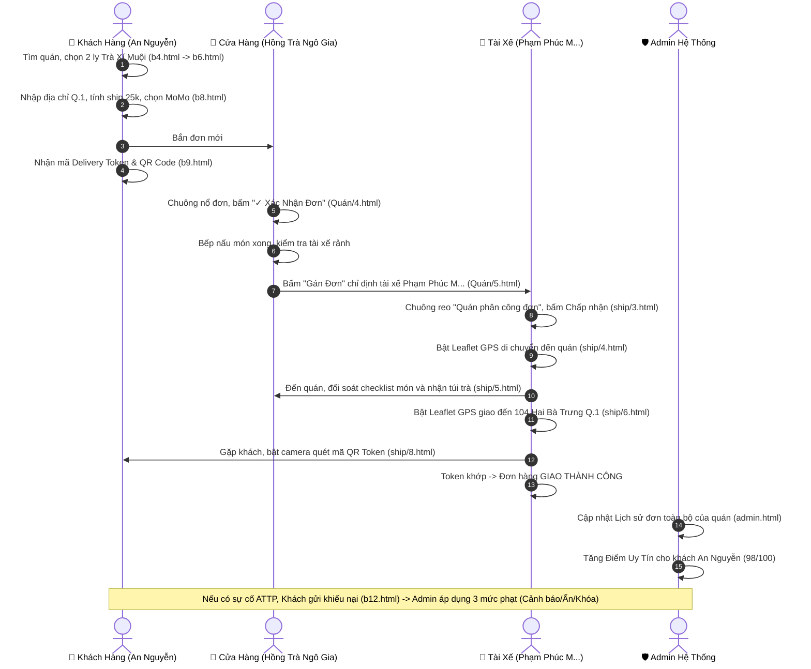

# TÀI LIỆU TOÀN BỘ CHỨC NĂNG HỆ THỐNG OISHI FOOD (4 ACTORS)
> **Đồ Án Chuyên Đề 2 • Hệ Sinh Thái Đặt & Giao Món Trực Tuyến Đa Nền Tảng TP.HCM**  
> *Phiên bản hoàn thiện: 2026 • Kiến trúc 4 Actor tương tác khép kín*

---

## MỤC LỤC
1. [Tổng Quan Hệ Sinh Thái & Kiến Trúc 4 Actor](#1-tổng-quan-hệ-sinh-thái--kiến-trúc-4-actor)
2. [Cấu Trúc Thư Mục & Các File Màn Hình](#2-cấu-trúc-thư-mục--các-file-màn-hình)
3. [Actor 1: Quản Trị Viên Hệ Thống (System Admin)](#3-actor-1-quản-trị-viên-hệ-thống-system-admin)
4. [Actor 2: Khách Hàng (Customer)](#4-actor-2-khách-hàng-customer)
5. [Actor 3: Cửa Hàng / Quán Ăn (Merchant / Store)](#5-actor-3-cửa-hàng--quán-ăn-merchant--store)
6. [Actor 4: Tài Xế Giao Hàng (Driver / Shipper)](#6-actor-4-tài-xế-giao-hàng-driver--shipper)
7. [Ma Trận Phân Quyền & Luồng Dữ Liệu Chéo (Data Flow & Matrix)](#7-ma-trận-phân-quyền--luồng-dữ-liệu-chéo)
8. [Hướng Dẫn Chạy Demo & Kiểm Thử](#8-hướng-dẫn-chạy-demo--kiểm-thử)

---

## 1. TỔNG QUAN HỆ SINH THÁI & KIẾN TRÚC 4 ACTOR

Hệ thống **Oishi Food** được xây dựng theo mô hình nền tảng đa bên (*Multi-sided Platform*) kết nối đồng bộ 4 chủ thể tham gia (4 Actors):

```
                               ┌─────────────────────────────────────────┐
                               │       🛡️ ACTOR 1: ADMIN SYSTEM          │
                               │           (File: admin.html)            │
                               │  • Duyệt quán (4 TT & 4 ảnh CCCD)       │
                               │  • Điểm uy tín khách hàng (TrustScore)  │
                               │  • Xem đơn toàn bộ & Tài xế quán        │
                               │  • Xử lý khiếu nại (Cảnh báo/Ẩn/Khóa)   │
                               └────────────────────┬────────────────────┘
                                                    │ (Giám sát & Chế tài)
                   ┌────────────────────────────────┼────────────────────────────────┐
                   ▼                                ▼                                ▼
  ┌─────────────────────────────────┐ ┌───────────────────────────┐ ┌─────────────────────────────────┐
  │     👤 ACTOR 2: KHÁCH HÀNG      │ │   🏪 ACTOR 3: CỬA HÀNG    │ │      🛵 ACTOR 4: TÀI XẾ         │
  │      (Thư mục: khách/)          │ │    (Thư mục: Quán/)       │ │       (Thư mục: ship/)          │
  │ • Tìm quán, tùy biến món        │ │ • Kênh quán & Bán hàng    │ │ • Vào ca trực tuyến             │
  │ • Giỏ hàng, tính ship TP.HCM    │ │ • Duyệt đơn, chuẩn bị món │ │ • Nổ đơn do quán phân công      │
  │ • Thanh toán MoMo / VNPAY / COD │ │ • Quản lý shipper quán    │ │ • GPS Leaflet lấy & giao món    │
  │ • Theo dõi đơn & Mã QR Token    │ │ • Điều phối gán đơn       │ │ • Đối soát bill & Quét QR giao  │
  │ • Quản lý Điểm Uy Tín & Khiếu nại│ │ • Thực đơn CRUD, Combo    │ │ • Thu nhập & Điểm đánh giá ⭐   │
  └────────────────┬────────────────┘ └─────────────┬─────────────┘ └────────────────┬────────────────┘
                   │                                │                                │
                   │ (1. Đặt đơn hàng)              │ (2. Nấu & Gán tài xế)          │ (3. Giao & Quét QR)
                   └───────────────────────────────▶│───────────────────────────────▶│
```

### Điểm nhấn kỹ thuật & quy chuẩn cốt lõi:
- **Nguyên tắc nền tảng phi doanh thu:** Nền tảng đóng vai trò kết nối điều phối, không thu phí trung gian, không phát sinh số liệu doanh thu nền tảng hay bồi thường.
- **Xác minh danh tính nghiêm ngặt (KYC):** Cửa hàng đăng ký bắt buộc cung cấp Số CCCD và 4 ảnh xác thực (Mặt trước CCCD, Mặt sau CCCD, Ảnh chân dung lúc đăng ký, Ảnh cửa hàng).
- **Cơ chế chống bùng đơn (Anti-Booming):** Khách hàng được định danh và theo dõi bằng **Điểm Uy Tín (TrustScore)**. Khách hàng có điểm uy tín cao được ưu tiên COD, khách hàng điểm thấp/bị cảnh báo sẽ bị hạn chế đặt đơn.
- **Xử phạt khiếu nại 3 mức độ:** Cảnh báo gian hàng ➔ Ẩn quán khỏi kết quả tìm kiếm ➔ Khóa tài khoản vĩnh viễn.
- **Giao nhận khép kín bằng mã QR Delivery Token:** Khách hàng giữ mã QR bí mật trên app, chỉ khi tài xế giao đúng món tận tay và quét mã thành công thì đơn hàng mới được đóng.

---

## 2. CẤU TRÚC THƯ MỤC & CÁC FILE MÀN HÌNH

Hệ thống được tổ chức khoa học với tổng cộng **30 file HTML** hoạt động độc lập và liên kết chéo:

```
chuyende2/
│
├── admin.html                   # Trang Quản Trị Hệ Thống (Actor 1)
├── demo.html                    # Trung Tâm Trình Diễn Toàn Diện 4-in-1 Emulator
├── CHUC_NANG_4_ACTORS.md        # File Tài Liệu Này
│
├── khách/                       # Ứng Dụng Khách Hàng (Actor 2 - 12 Màn hình)
│   ├── b1.html                  # 🏠 Trang chủ chính thức chuẩn ShopeeFood
│   ├── b4.html                  # 🔍 Khám phá quán ăn & Tìm kiếm theo khu vực TP.HCM
│   ├── b5.html                  # 📋 Chi tiết menu quán Hồng Trà Ngô Gia
│   ├── b6.html                  # 🧋 Modal tùy chọn Size, Đá, Đường, Topping
│   ├── b7.html                  # 🛒 Giỏ hàng riêng của quán
│   ├── b8.html                  # 💳 Thanh toán Checkout & Phân vùng cước ship TP.HCM
│   ├── b9.html                  # 🛵 Theo dõi trạng thái đơn hàng & Mã QR Token
│   ├── b3.html                  # 🧾 Quản lý lịch sử đơn hàng (Đang đến, Đã xong)
│   ├── b10.html                 # 🔔 Hộp thư thông báo
│   ├── b11.html                 # 👤 Trang cá nhân "Tôi" & Thẻ Điểm Uy Tín (⭐ 98/100)
│   ├── b12.html                 # ⚖️ Trung tâm gửi khiếu nại đơn hàng vi phạm
│   └── a1.html                  # ✨ Giỏ hàng đa quán All-in-One tích hợp
│
├── Quán/                        # Ứng Dụng Cửa Hàng / Quán Ăn (Actor 3 - 8 Màn hình)
│   ├── 1.html                   # 🛵 Quản lý đội ngũ tài xế nội bộ của quán
│   ├── 2.html                   # 🍽️ Quản lý thực đơn CRUD & Check-in mở cửa
│   ├── 3.html                   # 🎁 Tạo gói Combo món ăn khuyến mãi
│   ├── 4.html                   # 🛎️ Tiếp nhận & Duyệt đơn hàng mới từ khách
│   ├── 5.html                   # 📊 Kênh Quản Lý Quán (Dashboard & Gán shipper)
│   ├── 6.html                   # 📦 Lịch sử đơn hàng toàn bộ của quán
│   ├── 7.html                   # 📈 Báo cáo doanh số & Thống kê món bán chạy
│   └── 8.html                   # ⚙️ Hồ sơ quán & Xác thực CCCD chủ quán với Admin
│
└── ship/                        # Ứng Dụng Tài Xế Giao Hàng (Actor 4 - 8 Màn hình)
    ├── 1.html                   # 🧾 Lịch sử cuốc xe & Thu nhập tài xế
    ├── 2.html                   # 🟢 Màn hình vào ca làm việc trực tuyến
    ├── 3.html                   # 🛎️ Pop-up nhận nhiệm vụ nổ đơn được phân công
    ├── 4.html                   # 📍 Đến quán lấy món (Bản đồ Leaflet GPS Chặng 1)
    ├── 5.html                   # 📦 Đối soát Checklist món ăn & Lấy hàng
    ├── 6.html                   # 🛵 Đến điểm giao khách (Bản đồ Leaflet GPS Chặng 2)
    ├── 7.html                   # 👤 Hồ sơ tài xế & Đánh giá uy tín ⭐
    └── 8.html                   # 📷 Quét camera mã QR Token để hoàn tất cuốc giao
```

---

## 3. ACTOR 1: QUẢN TRỊ VIÊN HỆ THỐNG (SYSTEM ADMIN)
*File triển khai:* [admin.html](file:///c:/Users/Fuck/Downloads/chuyende2/admin.html)

Admin đóng vai trò là "trọng tài" giám sát toàn bộ hoạt động của hệ sinh thái, phê duyệt đối tác, đánh giá người dùng và thực thi các chế tài xử phạt.

### ⭐ 3.1. Các Chức Năng Chính (Core Features)

1. **Quản Lý Đối Tác Cửa Hàng Với Chuẩn 4 Trạng Thái:**
   - Hỗ trợ đúng 4 trạng thái hoạt động:
     - `Chờ duyệt (PENDING)`: Quán mới đăng ký, chờ kiểm tra hồ sơ pháp lý.
     - `Đang hoạt động (OPEN)`: Quán hợp lệ, hiển thị trên ứng dụng khách hàng.
     - `Bị khóa (LOCKED)`: Quán vi phạm quy chế hoặc bị khiếu nại nghiêm trọng.
     - `Tạm nghỉ (CLOSED)`: Quán tạm dừng bán hàng theo ca hoặc bảo trì.
   - Thao tác nhanh: Duyệt quán (`✓ Duyệt`), Từ chối (`✕ Hủy`), Đổi mật khẩu (`🔑`), Khóa/Mở khóa (`🔒`/`🔓`), Xóa quán (`🗑️`).
   - Riêng tài khoản `Chờ duyệt (PENDING)`: Chỉ hiển thị duy nhất 2 nút `✓ Duyệt` và `✕ Hủy` nhằm đảm bảo tính bảo mật.

2. **Thẩm Định Hồ Sơ Xác Minh Pháp Lý (KYC Cửa Hàng):**
   - Xem chi tiết Số CCCD của chủ hộ kinh doanh (12 số).
   - Kiểm tra trực quan bộ 4 ảnh hồ sơ:
     1. Ảnh mặt trước CCCD
     2. Ảnh mặt sau CCCD
     3. Ảnh chụp chân dung lúc đăng ký
     4. Ảnh thực tế biển hiệu/gian hàng

3. **Danh Sách Đơn Đặt Món Toàn Bộ Tại Quán:**
   - Khi bấm vào tên bất kỳ quán nào (kèm huy hiệu `Xem đơn & TX ↗️`) hoặc nút `📋`, Admin mở modal chi tiết:
   - **Thanh mini stats thời gian thực:**
     - 🔵 Tổng số đơn phục vụ của quán
     - 🟢 Số đơn hoàn thành thành công
     - 🟡 Số đơn đang có shipper vận chuyển
     - 🔴 Số đơn bị bùng hàng / hủy đơn
   - **Thanh tìm kiếm & Lọc đơn toàn năng:** Tìm kiếm theo mã đơn (`#ORD-xxx`), tên khách hàng, số điện thoại, tên món ăn, tên tài xế.
   - **Dropdown lọc theo trạng thái đơn:** Đang giao hàng (`DELIVERING`), Thành công (`COMPLETED`), Bị bùng đơn (`BOOM`), Đã hủy (`CANCELLED`).
   - Bảng chi tiết: Mã đơn, giờ đặt, khách hàng, số điện thoại, danh sách món kèm ghi chú, tài xế phụ trách và huy hiệu trạng thái.

4. **Quản Lý Đội Ngũ Tài Xế Thuộc Quán:**
   - Xem danh sách các shipper cố định được gắn với cửa hàng.
   - Hiển thị: Mã tài xế (TX-xx), Họ tên, Số điện thoại, Dòng xe & Biển số xe, Số đơn đã hoàn tất cho quán, Đánh giá sao uy tín ⭐, Trạng thái ca trực (`🟢 Đang rảnh`, `🚚 Đang giao`, `⏸️ Đang nghỉ`).

5. **Quản Lý Khách Hàng & Điểm Uy Tín (Customer TrustScore):**
   - Theo dõi danh sách khách hàng đặt món trên toàn hệ thống.
   - **Cột Điểm Uy Tín (`trustScore`):**
     - ⭐ **90 - 100 điểm (Xanh lá):** Khách hàng uy tín cao, nhận đơn đều đặn.
     - 🛡️ **70 - 89 điểm (Xanh dương):** Khách hàng tiêu chuẩn.
     - ⚠️ **Dưới 70 điểm (Đỏ cảnh báo):** Khách hàng có lịch sử hủy đơn, boom hàng, cần giám sát chặt chẽ.
   - Bộ lọc sắp xếp: Khách hàng uy tín cao nhất ➔ thấp nhất và ngược lại.
   - Khóa/mở khóa tài khoản khách hàng có dấu hiệu gian lận.

6. **Xử Lý Khiếu Nại Với 3 Mức Phạt Nghiêm Ngặt:**
   - Tiếp nhận các lá đơn khiếu nại từ khách hàng gửi về (vấn đề ATTP, dị vật, giao sai món, thái độ).
   - Áp dụng 3 chế tài:
     1. ⚠️ **Cảnh báo quán (WARN):** Gửi thông báo nhắc nhở vi phạm lần đầu.
     2. 👁️ **Ẩn gian hàng (HIDE):** Tạm ẩn quán khỏi ứng dụng khách hàng trong thời gian điều tra.
     3. 🔒 **Khóa tài khoản vĩnh viễn (LOCK):** Thu hồi quyền kinh doanh của quán trên hệ sinh thái Oishi Food.

### 💡 3.2. Các Chức Năng Phụ (Supporting Features)
- Quản lý Danh mục ẩm thực hệ thống (Thêm/Sửa/Xóa danh mục).
- Bộ lọc và tìm kiếm tức thì không tải lại trang.
- Lưu trữ trạng thái bền vững với `localStorage`.

---

## 4. ACTOR 2: KHÁCH HÀNG (CUSTOMER)
*Thư mục triển khai:* [khách/](file:///c:/Users/Fuck/Downloads/chuyende2/kh%C3%A1ch/)

Khách hàng là người trực tiếp tìm kiếm món ăn, đặt hàng, thanh toán và kiểm tra chất lượng dịch vụ.

### ⭐ 4.1. Các Chức Năng Chính (Core Features)

1. **Trang Chủ Khám Phá Món Ngon ([b1.html](file:///c:/Users/Fuck/Downloads/chuyende2/kh%C3%A1ch/b1.html)):**
   - Hiển thị vị trí người dùng (📍 Q.1, TP.HCM).
   - Banner khuyến mãi tự động (Đại tiệc 0 đồng, Freeship Extra).
   - Lưới danh mục ẩm thực trực quan: Cơm trưa 🍚, Trà sữa 🧋, Bún/Phở 🍜, Gà rán 🍗.
   - Đồng hồ đếm ngược Flash Sale giờ vàng.
   - Danh sách quán ăn nổi bật đề xuất cho khách.

2. **Khám Phá Quán & Tìm Kiếm Khu Vực ([b4.html](file:///c:/Users/Fuck/Downloads/chuyende2/kh%C3%A1ch/b4.html)):**
   - Ô tìm kiếm món ăn / tên quán tại TP.HCM.
   - Danh sách quán ăn hiển thị kèm cự ly di chuyển (km), số lượt đánh giá sao ⭐, giờ mở cửa.
   - Huy hiệu quán: `Đang Mở Cửa`, `Shipper Quán Giao`.

3. **Xem Menu Chi Tiết Quán Ăn ([b5.html](file:///c:/Users/Fuck/Downloads/chuyende2/kh%C3%A1ch/b5.html)):**
   - Thông tin quán Hồng Trà Ngô Gia (28 Tô Vĩnh Diện, Thủ Đức).
   - Danh sách voucher ưu đãi có thể lưu (Freeship 15k, Giảm 50%).
   - Món phổ biến bán chạy dạng cuộn ngang (Trà Xanh Sữa, Trà Bí Đao).
   - Phân loại menu theo tab: Thức uống mới, Thức uống hot, Cà phê.
   - Nút giỏ hàng nổi hiển thị số lượng món và số tiền tạm tính theo thời gian thực.

4. **Tùy Chọn Món Ăn & Topping ([b6.html](file:///c:/Users/Fuck/Downloads/chuyende2/kh%C3%A1ch/b6.html)):**
   - Cửa sổ Bottom Sheet trượt mượt mà chuẩn ShopeeFood.
   - Tùy chọn kích cỡ (Size M, Size L +6.000đ).
   - Tùy chọn lượng đá: Bình thường, Ít đá, Đá riêng.
   - Tùy chọn độ ngọt: 100% đường, 70% đường, 50% đường, 30% đường.
   - Tăng giảm số lượng và tự động cộng dồn giá tiền.

5. **Giỏ Hàng Quán Độc Lập ([b7.html](file:///c:/Users/Fuck/Downloads/chuyende2/kh%C3%A1ch/b7.html)):**
   - Quản lý giỏ hàng tách biệt cho từng quán để tránh nhầm lẫn khi đặt nhiều nơi.
   - Tăng/giảm số lượng từng món, tự động xóa món khi số lượng về 0.
   - Nút "Xóa tất cả" giỏ hàng.
   - Nút "Tiếp tục" chuyển sang bước thanh toán.

6. **Thanh Toán & Tính Phí Vận Chuyển TP.HCM ([b8.html](file:///c:/Users/Fuck/Downloads/chuyende2/kh%C3%A1ch/b8.html)):**
   - Dropdown chọn quận/huyện nhận hàng tại TP.HCM.
   - **Quy tắc phân vùng cước ship tự động:**
     - *Cùng quận quán (Nội quận):* **15.000 đ**
     - *Khác quận (Liên quận nội thành):* **25.000 đ**
     - *Ngoại thành (Huyện Hóc Môn, Huyện Củ Chi):* **45.000 đ**
   - Lựa chọn phương thức thanh toán: Ví MoMo, Cổng VNPAY, Tiền mặt COD.
   - Tóm tắt chi phí: Tiền món + Phí giao hàng = Tổng bill.
   - Nút "Đặt Đơn Ngay" kèm modal xác nhận thành công.

7. **Theo Dõi Tiến Trình Đơn Hàng & Mã QR Token ([b9.html](file:///c:/Users/Fuck/Downloads/chuyende2/kh%C3%A1ch/b9.html)):**
   - Stepper tiến trình trực tiếp: Quán nhận ➔ Nấu món ➔ Đang giao ➔ Giao xong.
   - **Tạo mã bảo mật Delivery Token & QR Code:** Mã định danh an toàn đưa cho tài xế quét khi giao đến nhà.
   - Thông tin tài xế phụ trách: Họ tên, avatar, nút gọi điện thoại 📞 liên hệ trực tiếp.

8. **Quản Lý Lịch Sử Đơn Hàng Của Khách ([b3.html](file:///c:/Users/Fuck/Downloads/chuyende2/kh%C3%A1ch/b3.html)):**
   - Tab chuyển đổi: *Tất cả*, *Đang đến (1)*, *Đã xong*.
   - Đơn đang đến có nút xem ngay tiến trình trực tiếp (`b9.html`).
   - Đơn đã giao có nút "Đặt lại món" và nút "⚠️ Khiếu nại" (`b12.html`).

9. **Trang Cá Nhân "Tôi" & Điểm Uy Tín ([b11.html](file:///c:/Users/Fuck/Downloads/chuyende2/kh%C3%A1ch/b11.html)):**
   - Hiển thị khách hàng An Nguyễn (0901.234.567).
   - **Huy hiệu Điểm Uy Tín ⭐ 98/100:** Giải thích tỷ lệ nhận hàng thành công 99.2%, 0 lần bùng hàng, quyền lợi được đặt COD không giới hạn (đồng bộ với cột Điểm Uy Tín trong `admin.html`).
   - Sổ địa chỉ nhận hàng và quản lý ví liên kết.

10. **Cổng Gửi Khiếu Nại Đơn Hàng Lên Admin ([b12.html](file:///c:/Users/Fuck/Downloads/chuyende2/kh%C3%A1ch/b12.html)):**
    - Chọn mã đơn cần phản ánh (VD: #ORD-7712 Quán Ốc Đêm 77).
    - Phân loại vấn đề: Vệ sinh ATTP (có mùi lạ, đau bụng), Giao sai/thiếu món, Thái độ shipper.
    - Đính kèm ảnh minh chứng món ăn.
    - Khiếu nại được chuyển thẳng sang cổng Quản Trị `admin.html` để ban quản trị áp dụng 3 mức phạt (Cảnh báo, Ẩn quán, Khóa tài khoản).

### 💡 4.2. Các Chức Năng Phụ (Supporting Features)
- Hộp thư thông báo cập nhật tình trạng đơn hàng và voucher khuyến mãi ([b10.html](file:///c:/Users/Fuck/Downloads/chuyende2/kh%C3%A1ch/b10.html)).
- Mô phỏng giỏ hàng đa quán tích hợp All-in-One ([a1.html](file:///c:/Users/Fuck/Downloads/chuyende2/kh%C3%A1ch/a1.html)).

---

## 5. ACTOR 3: CỬA HÀNG / QUÁN ĂN (MERCHANT / STORE)
*Thư mục triển khai:* [Quán/](file:///c:/Users/Fuck/Downloads/chuyende2/Qu%C3%A1n/)

Cửa hàng là bên tiếp nhận yêu cầu từ khách, chế biến món ăn và trực tiếp quản lý/điều phối đội tài xế nội bộ để giao hàng.

### ⭐ 5.1. Các Chức Năng Chính (Core Features)

1. **Kênh Quản Lý Quán & Mở/Đóng Ca ([5.html](file:///c:/Users/Fuck/Downloads/chuyende2/Qu%C3%A1n/5.html)):**
   - Bảng điều khiển Merchant Dashboard trung tâm.
   - Công tắc toggle chuyển trạng thái bán hàng: *Đang Bán* 🟢 ⟷ *Tạm Đóng* 🔴.
   - Thống kê doanh thu hôm nay (1.480.000 đ) và số đơn hoàn tất (24 đơn).

2. **Quản Lý Đội Ngũ Tài Xế Nội Bộ Quán ([1.html](file:///c:/Users/Fuck/Downloads/chuyende2/Qu%C3%A1n/1.html)):**
   - Danh sách shipper trực thuộc quán:
     - 1. **Phạm Phúc M... (TX-19)** - Honda Wave Alpha - 148 đơn - `🟢 Đang rảnh`
     - 2. **Trần Văn Nam (TX-14)** - Yamaha Sirius - 210 đơn - `🚚 Đang giao đơn`
     - 3. **Lê Hữu Nghĩa (TX-08)** - Honda AirBlade - 95 đơn - `⏸️ Nghỉ ca`
   - Nút gọi liên hệ tài xế, nút thêm tài xế mới vào quán.

3. **Điều Phối & Gán Đơn Trực Tiếp Cho Shipper ([5.html](file:///c:/Users/Fuck/Downloads/chuyende2/Qu%C3%A1n/5.html)):**
   - Danh sách đơn hàng mới cần giao.
   - Dropdown chọn tài xế đang rảnh trong quán (Phạm Phúc M...).
   - Nút **"Gán Đơn"**: Tự động kích hoạt chuông reo nổ đơn trên ứng dụng tài xế (`ship/3.html`).

4. **Tiếp Nhận & Duyệt Đơn Hàng Mới ([4.html](file:///c:/Users/Fuck/Downloads/chuyende2/Qu%C3%A1n/4.html)):**
   - Chuông thông báo khi có khách đặt đơn #ORD_OISHI_88291.
   - Xem chi tiết món: 1x Trà Xí Muội Ô Long, 1x Trà Xí Muội Ngô Gia, tiền bill 53.000đ.
   - Nút **"✓ Xác Nhận Đơn"** để chuyển sang bước nấu và gán tài xế.
   - Nút **"Hủy Đơn"** kèm chọn lý do rõ ràng (Hết món, Quán quá tải).

5. **Quản Lý Thực Đơn Món Ăn CRUD ([2.html](file:///c:/Users/Fuck/Downloads/chuyende2/Qu%C3%A1n/2.html)):**
   - Nút Check-in mở cửa quán.
   - Thêm món mới vào menu (Tên món, danh mục, giá bán, ảnh minh họa).
   - Sửa thông tin món và Xóa món khỏi thực đơn.
   - Bộ đếm số lượng món đang mở bán.

6. **Tạo Gói Combo Món Ăn Khuyến Mãi ([3.html](file:///c:/Users/Fuck/Downloads/chuyende2/Qu%C3%A1n/3.html)):**
   - Ghép món chính + đồ uống thành combo trọn gói.
   - Thiết lập giá bán combo giảm giá ưu đãi để kích cầu đơn hàng.

7. **Lịch Sử Đơn Hàng Toàn Bộ Của Quán ([6.html](file:///c:/Users/Fuck/Downloads/chuyende2/Qu%C3%A1n/6.html)):**
   - Xem tất cả đơn quá khứ và hiện tại của quán.
   - Bộ lọc theo: Đang giao, Thành công, Đã hủy/Bùng đơn.

8. **Báo Cáo & Thống Kê Quán ([7.html](file:///c:/Users/Fuck/Downloads/chuyende2/Qu%C3%A1n/7.html)):**
   - Báo cáo doanh số bán trong ngày.
   - Top 3 món bán chạy nhất: Trà Xí Muội Ô Long (420 ly), Trà Xí Muội Ngô Gia (380 ly), Trà Xanh Sữa (290 ly).
   - Tổng hợp đánh giá khách hàng (⭐ 4.8/5 với 520+ đánh giá tích cực).

### 💡 5.2. Các Chức Năng Phụ (Supporting Features)
- Hồ sơ cửa hàng & Xác thực thông tin pháp lý CCCD chủ quán với Admin ([8.html](file:///c:/Users/Fuck/Downloads/chuyende2/Qu%C3%A1n/8.html)).
- Cấu hình giờ mở cửa hàng ngày và thời gian làm món mặc định (15 phút).

---

## 6. ACTOR 4: TÀI XẾ GIAO HÀNG (DRIVER / SHIPPER)
*Thư mục triển khai:* [ship/](file:///c:/Users/Fuck/Downloads/chuyende2/ship/)

Tài xế hoạt động theo mô hình **Phát đơn tự động / Nổ đơn ShopeeFood & Grab**, tự do nhận cuốc, chạy ghép nhiều đơn cùng lúc, có quyền hủy nhận đơn trước khi lấy món để hoàn về hệ thống, di chuyển lấy món bằng bản đồ GPS Leaflet, kiểm tra món và giao tận tay khách hàng với cơ chế quét mã QR đối soát.

### ⭐ 6.1. Các Chức Năng Chính (Core Features)

1. **Màn Hình Vào Ca Trực Tuyến & Bảng Điều Khiển ([2.html](file:///c:/Users/Fuck/Downloads/chuyende2/ship/2.html)):**
   - Công tắc toggle **"TRỰC TUYẾN / NGHỈ CA"** phong cách neon với hiệu ứng sóng pulse.
   - Quản lý danh sách **Đơn hàng đang chạy (Multi-order Active List)** cho phép tài xế nhận ghép tối đa 3 đơn cùng lúc.
   - Thẻ thu nhập nhanh trong ngày (385.000 đ - 12 cuốc hoàn thành).

2. **Tiếp Nhận Nhiệm Vụ Nổ Đơn Mới ([3.html](file:///c:/Users/Fuck/Downloads/chuyende2/ship/3.html)):**
   - Pop-up chuông nổ đơn ShopeeFood / Grab rực rỡ với đồng hồ 30 giây đếm ngược.
   - Hiển thị chi tiết: Thu nhập cuốc (+25.000đ), cự ly di chuyển (6.2 km), lộ trình 2 chặng.
   - Nút **"🛵 NHẬN ĐƠN NGAY"** và nút **"✕ Bỏ qua"**.

3. **Bản Đồ GPS Chặng 1 - Đến Quán Lấy Món ([4.html](file:///c:/Users/Fuck/Downloads/chuyende2/ship/4.html)):**
   - Bản đồ **Leaflet OpenStreetMap GPS** dẫn đường tương tác với chỉ dẫn Google Maps Navigation.
   - **Thanh Order Switcher Bar:** Chuyển đổi linh hoạt giữa các đơn đang chạy ghép.
   - **Nút 🔴 Hủy Nhận Đơn (Trước khi lấy món):** Cho phép tài xế hủy đơn do sự cố xe/quán quá đông. Đơn bị hủy sẽ tự động chuyển về trạng thái `SEARCHING_DRIVER` ("Đang tìm tài xế khác...") và xuất hiện lại trên hệ thống cho tài xế khác nhận.
   - Thanh trượt gạt ngang xác nhận: *"Gạt sang phải khi ĐÃ ĐẾN QUÁN"*.

4. **Đối Soát Checklist & Nhận Túi Thức Ăn ([5.html](file:///c:/Users/Fuck/Downloads/chuyende2/ship/5.html)):**
   - Danh sách món trong bill để shipper đối chiếu trước khi rời quán:
     - [x] 1x Trà Xí Muội Ô Long (Size M)
     - [x] 1x Trà Xí Muội Ngô Gia (Size M)
   - **Khóa quyền hủy đơn:** Khi tài xế gạt *"Đã lấy hàng & Đi giao"*, hệ thống chuyển `pickupConfirmed = true` và ẩn hẳn nút hủy đơn để bảo vệ an toàn thực phẩm.

5. **Bản Đồ GPS Chặng 2 - Đến Điểm Giao Khách ([6.html](file:///c:/Users/Fuck/Downloads/chuyende2/ship/6.html)):**
   - Bản đồ Leaflet GPS dẫn đường tới nhà khách An Nguyễn tại Quận 1.
   - Nút gọi khách hàng 📞, nhắn tin 💬 và mở Google Maps ngoài 🧭.
   - Thanh trượt gạt ngang xác nhận: *"Gạt sang phải khi ĐÃ ĐẾN ĐIỂM GIAO"*.

6. **Quét Camera Mã QR Token Hoàn Tất Cuốc Giao ([8.html](file:///c:/Users/Fuck/Downloads/chuyende2/ship/8.html)):**
   - Khung camera quét mã đối chiếu **Delivery Token** trên màn hình app khách hàng với hiệu ứng laser quét sống động.
   - Tự động nhận diện token hợp lệ `TOKEN_OISHI_88291`, chuyển trạng thái đơn thành **COMPLETED** và hiển thị popup chúc mừng cộng tiền thu nhập.

7. **Báo Cáo Thu Nhập & Lịch Sử Cuốc Xe ([1.html](file:///c:/Users/Fuck/Downloads/chuyende2/ship/1.html)):**
   - Thẻ tổng thu nhập (385.000 đ), lọc theo Hôm Nay / Tuần Này / Tháng Này.
   - Danh sách các cuốc xe đã hoàn thành kèm đánh giá ⭐.

8. **Hồ Sơ & Đánh Giá Uy Tín Tài Xế ([7.html](file:///c:/Users/Fuck/Downloads/chuyende2/ship/7.html)):**
   - Tài xế: Trần Văn Nam (Mã TX-14 - Hạng Kim Cương).
   - Đánh giá uy tín: ⭐ 4.9/5 (99.2% hoàn thành cuốc).
   - Phương tiện đăng ký: Yamaha Sirius (59-T1 882.91).

### 💡 6.2. Các Chức Năng Phụ (Supporting Features)
- Nút mở Google Maps chỉ đường ứng dụng ngoài.
- Nút báo cáo sự cố khẩn cấp (🚨) hoặc xử lý khách bùng đơn.

---

## 7. MA TRẬN PHÂN QUYỀN & LUỒNG DỮ LIỆU CHÉO

### 7.1. Bảng Ma Trận Phân Quyền (CRUD Permissions Matrix)

| Thực Thể / Chức Năng | 🛡️ Admin Hệ Thống | 👤 Khách Hàng | 🏪 Cửa Hàng | 🛵 Tài Xế |
| :--- | :---: | :---: | :---: | :---: |
| **Đăng ký / Hồ sơ đối tác CCCD** | Duyệt / Khóa | Không có quyền | Tạo hồ sơ / Cập nhật | Không có quyền |
| **Trạng thái kinh doanh quán** | Khóa / Ẩn gian hàng | Xem trạng thái | Bật / Tắt mở ca | Không có quyền |
| **Thực đơn & Giá bán món ăn** | Giám sát | Xem / Chọn món | Thêm / Sửa / Xóa | Không có quyền |
| **Tạo combo khuyến mãi** | Giám sát | Đặt combo | Tạo gói combo | Không có quyền |
| **Tạo & Đặt đơn hàng mới** | Xem toàn bộ | Tạo đơn / Hủy đơn | Duyệt / Từ chối | Nhận / Chấp nhận |
| **Tính phí ship theo cự ly TP.HCM** | Định cấu hình | Xem tiền ship tự động | Không can thiệp | Thu tiền cước ship |
| **Gán đơn cho tài xế nội bộ** | Giám sát | Không có quyền | Chọn & Gán shipper | Nhận thông báo nổ đơn |
| **Bản đồ dẫn đường Leaflet GPS** | Giám sát | Xem shipper di chuyển | Không can thiệp | Điều hướng 2 chặng |
| **Mã QR Delivery Token** | Giám sát | Tạo & Xuất mã QR | Không can thiệp | Quét camera đối soát |
| **Điểm Uy Tín Người Dùng (Trust)**| Chấm điểm / Quản lý | Xem điểm (⭐ 98) | Không can thiệp | Không can thiệp |
| **Khiếu nại & Xử phạt (3 mức)** | Phạt Cảnh báo/Ẩn/Khóa | Gửi khiếu nại & ảnh | Nhận thông báo phạt | Nhận thông báo phạt |

---

### 7.2. Luồng Dữ Liệu Tuần Tự (Full Order Lifecycle Sequence)



---

## 8. HƯỚNG DẪN CHẠY DEMO & KIỂM THỬ

### Cách 1: Sử Dụng Trung Tâm Trình Diễn Toàn Diện 4-in-1 (Khuyên Dùng)
Mở trực tiếp file **[demo.html](file:///c:/Users/Fuck/Downloads/chuyende2/demo.html)** trên bất kỳ trình duyệt web nào (Chrome, Edge, Firefox, Cốc Cốc):
1. Bạn sẽ thấy **3 chiếc điện thoại mô phỏng chạy song song** trên cùng một màn hình (Khách Hàng, Quán Ăn, Tài Xế) cùng liên kết tới Admin Portal.
2. Dưới mỗi chiếc điện thoại có thanh chuyển màn hình nhanh (**Screen Pills**) giúp bạn bấm là mở ngay bất kỳ màn hình nào trong số 28 màn hình con.
3. Có phần **Sơ đồ kịch bản mô phỏng 4 bước** giúp trình bày bài thuyết trình đồ án cực kỳ mượt mà.

### Cách 2: Trải Nghiệm Trực Tiếp Từng Ứng Dụng Độc Lập
- 🛡️ **Admin Portal:** Mở file [admin.html](file:///c:/Users/Fuck/Downloads/chuyende2/admin.html)
- 👤 **App Khách Hàng:** Mở file [khách/b1.html](file:///c:/Users/Fuck/Downloads/chuyende2/kh%C3%A1ch/b1.html)
- 🏪 **App Cửa Hàng:** Mở file [Quán/5.html](file:///c:/Users/Fuck/Downloads/chuyende2/Qu%C3%A1n/5.html)
- 🛵 **App Tài Xế:** Mở file [ship/2.html](file:///c:/Users/Fuck/Downloads/chuyende2/ship/2.html)

---
*Tài liệu được biên soạn đồng bộ với mã nguồn thực tế của dự án Oishi Food Platform.*
