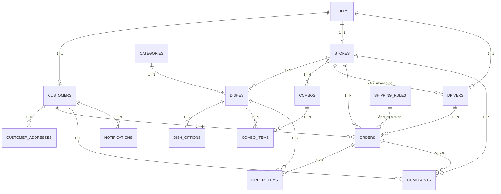

# BÁO CÁO PHÂN TÍCH VÀ THIẾT KẾ CƠ SỞ DỮ LIỆU (CSDL)
## HỆ THỐNG GIAO ĐỒ ĂN TRỰC TUYẾN OISHI FOOD (4 ACTORS)

---

## 1. TỔNG QUAN HỆ THỐNG VÀ PHẠM VI NGHIỆP VỤ

Hệ thống **Oishi Food** vận hành đồng bộ trên 4 nhóm tác nhân (Actors):
1. **Khách hàng (Customer - App Khách)**: Đăng ký/đăng nhập, duyệt danh mục, giỏ hàng ShopeeFood-style, đặt món, chọn địa chỉ TP.HCM, thanh toán COD/QR MoMo, theo dõi đơn thời gian thực, đánh giá & khiếu nại. Điểm uy tín (`trust_score`) khởi tạo 100 điểm.
2. **Cửa hàng (Merchant - App Quán)**: Quản lý gian hàng (4 trạng thái: `PENDING`, `OPEN`, `LOCKED`, `CLOSED`), hồ sơ CCCD 4 ảnh, menu món ăn, nhóm tùy chọn (size, đường, đá, topping), combo khuyến mãi, tiếp nhận đơn, chỉ định tài xế quán (`TX-19`, `TX-14`, `TX-08`).
3. **Tài xế (Driver/Shipper - App Ship)**: Tài xế nội bộ của từng quán, nhận đơn, định vị GPS lộ trình TP.HCM, xác thực giao hàng bằng mã **Delivery Token QR Code**, báo cáo sự cố boom hàng.
4. **Quản trị viên (Admin - Admin Web)**: Duyệt cửa hàng mới (xem xét CCCD 4 ảnh), áp chế tài xử lý khiếu nại (3 mức phạt: Cảnh cáo, Ẩn món, Khóa quán), quản lý khách hàng & điểm uy tín (`trust_score`), tra cứu lịch sử đơn & tài xế thuộc quán, giám sát cấu hình phí ship TP.HCM.

> **Quy tắc đặc thù hệ sinh thái**: Hệ thống **không** tính toán doanh thu/bồi hoàn/chiết khấu nền tảng. Tất cả giao dịch tài chính do Quán - Khách - Tài xế thanh toán trực tiếp.

---

## 2. MÔ HÌNH THỰC THỂ LIÊN KẾT (ERD & MỐI QUAN HỆ)



---

## 3. ĐẶC TẢ TỪ ĐIỂN DỮ LIỆU CHI TIẾT (15 BẢNG)

### Bảng 1: `users` (Tài khoản người dùng hệ thống)
Lưu trữ thông tin xác thực và phân quyền cho toàn bộ 4 tác nhân.

| Tên Cột | Kiểu Dữ Liệu | Ràng Buộc | Ý Nghĩa / Mô Tả |
| :--- | :--- | :--- | :--- |
| `user_id` | BIGINT | PRIMARY KEY, AUTO_INCREMENT | Mã định danh người dùng duy nhất |
| `phone_number` | VARCHAR(15) | UNIQUE, NOT NULL | Số điện thoại đăng nhập chính thức |
| `password_hash` | VARCHAR(255) | NOT NULL | Chuỗi băm mật khẩu bảo mật (BCrypt) |
| `full_name` | VARCHAR(100) | NOT NULL | Họ và tên người dùng |
| `email` | VARCHAR(100) | UNIQUE, NULL | Địa chỉ email liên lạc |
| `role` | ENUM | NOT NULL | `ADMIN`, `CUSTOMER`, `MERCHANT`, `DRIVER` |
| `is_active` | BOOLEAN | DEFAULT TRUE | Trạng thái kích hoạt tài khoản |
| `created_at` | DATETIME | DEFAULT CURRENT_TIMESTAMP | Thời điểm khởi tạo tài khoản |
| `updated_at` | DATETIME | ON UPDATE CURRENT_TIMESTAMP | Thời điểm cập nhật thông tin |

---

### Bảng 2: `customers` (Hồ sơ khách hàng)
Lưu trữ thông tin bổ sung của khách hàng, đặc biệt là **Điểm uy tín** và thống kê boom hàng.

| Tên Cột | Kiểu Dữ Liệu | Ràng Buộc | Ý Nghĩa / Mô Tả |
| :--- | :--- | :--- | :--- |
| `customer_id` | BIGINT | PRIMARY KEY | Khóa chính, tham chiếu `users(user_id)` |
| `avatar_url` | VARCHAR(255) | NULL | Đường dẫn ảnh đại diện |
| `trust_score` | INT | DEFAULT 100, CHECK(0..100) | **Điểm uy tín** (Khởi tạo 100, An Nguyễn = 98) |
| `total_orders` | INT | DEFAULT 0 | Tổng số lượng đơn đã đặt |
| `completed_orders`| INT | DEFAULT 0 | Số đơn hàng giao thành công |
| `boom_orders` | INT | DEFAULT 0 | Số đơn bom/từ chối nhận hàng không lý do |
| `membership_tier`| ENUM | DEFAULT 'STANDARD' | Hạng thành viên: `STANDARD`, `SILVER`, `GOLD` |

---

### Bảng 3: `customer_addresses` (Sổ địa chỉ giao hàng)
Lưu trữ danh sách địa chỉ nhận hàng của khách hàng tại khu vực TP.HCM.

| Tên Cột | Kiểu Dữ Liệu | Ràng Buộc | Ý Nghĩa / Mô Tả |
| :--- | :--- | :--- | :--- |
| `address_id` | BIGINT | PRIMARY KEY, AUTO_INCREMENT | Khóa chính địa chỉ |
| `customer_id` | BIGINT | FOREIGN KEY (`customers.customer_id`) | Khách hàng sở hữu địa chỉ |
| `receiver_name` | VARCHAR(100) | NOT NULL | Tên người nhận hàng tại điểm giao |
| `receiver_phone`| VARCHAR(15) | NOT NULL | Số điện thoại người nhận hàng |
| `street_address`| VARCHAR(255) | NOT NULL | Số nhà, tên đường, tòa nhà/phòng |
| `ward` | VARCHAR(100) | NOT NULL | Phường / Xã (thuộc TP.HCM) |
| `district` | VARCHAR(100) | NOT NULL | Quận / Huyện (thuộc TP.HCM) |
| `latitude` | DECIMAL(10,8)| NULL | Tọa độ vĩ độ định vị bản đồ GPS |
| `longitude` | DECIMAL(11,8)| NULL | Tọa độ kinh độ định vị bản đồ GPS |
| `is_default` | BOOLEAN | DEFAULT FALSE | Đánh dấu địa chỉ mặc định |

---

### Bảng 4: `categories` (Danh mục ngành hàng)
Phân loại thực phẩm trong hệ thống (Đồ uống, Cơm, Bún - Phở, Gà rán...).

| Tên Cột | Kiểu Dữ Liệu | Ràng Buộc | Ý Nghĩa / Mô Tả |
| :--- | :--- | :--- | :--- |
| `category_id` | INT | PRIMARY KEY, AUTO_INCREMENT | Mã định danh danh mục món |
| `category_name`| VARCHAR(100) | NOT NULL, UNIQUE | Tên danh mục hiển thị trên App Khách |
| `icon_url` | VARCHAR(255) | NULL | Biểu tượng minh họa danh mục |
| `display_order`| INT | DEFAULT 0 | Thứ tự ưu tiên sắp xếp trên giao diện |
| `is_active` | BOOLEAN | DEFAULT TRUE | Trạng thái hiển thị danh mục |

---

### Bảng 5: `stores` (Cửa hàng / Quán ăn)
Thực thể trung tâm phía đối tác bán hàng. Quản lý **4 trạng thái quán**, hồ sơ CCCD 4 ảnh và chế tài kỷ luật.

| Tên Cột | Kiểu Dữ Liệu | Ràng Buộc | Ý Nghĩa / Mô Tả |
| :--- | :--- | :--- | :--- |
| `store_id` | BIGINT | PRIMARY KEY | Khóa chính, liên kết `users(user_id)` |
| `store_name` | VARCHAR(150) | NOT NULL | Tên quán hiển thị (ví dụ: Trà Sữa Phúc Long) |
| `store_phone` | VARCHAR(15) | NOT NULL | Số hotline hỗ trợ khách hàng của quán |
| `address` | VARCHAR(255) | NOT NULL | Địa chỉ thực tế của quán tại TP.HCM |
| `district` | VARCHAR(100) | NOT NULL | Quận/Huyện hoạt động (ví dụ: Quận 1, Quận 3) |
| `store_status` | ENUM | DEFAULT 'PENDING' | **4 trạng thái**: `PENDING` (chờ duyệt), `OPEN` (mở bán), `LOCKED` (bị khóa), `CLOSED` (tạm đóng) |
| `cccd_number` | VARCHAR(20) | NULL | Số định danh CCCD/Căn cước công dân chủ quán |
| `cccd_front_url`| VARCHAR(255)| NULL | Ảnh mặt trước CCCD |
| `cccd_back_url` | VARCHAR(255)| NULL | Ảnh mặt sau CCCD |
| `cccd_hold_url` | VARCHAR(255)| NULL | Ảnh chụp chủ quán cầm CCCD trên tay |
| `cccd_portrait_url`| VARCHAR(255)| NULL | Ảnh chân dung rõ mặt đối chiếu sinh trắc |
| `penalty_tier` | ENUM | DEFAULT 'NONE' | Chế tài Admin áp đặt: `NONE`, `WARN` (cảnh cáo), `HIDE` (ẩn món), `LOCK` (khóa) |
| `penalty_reason`| TEXT | NULL | Lý do xử phạt vi phạm quán |
| `rating_avg` | DECIMAL(3,2) | DEFAULT 5.00 | Điểm đánh giá trung bình từ khách hàng |
| `created_at` | DATETIME | DEFAULT CURRENT_TIMESTAMP | Thời điểm nộp đơn đăng ký quán |

---

### Bảng 6: `dishes` (Món ăn / Thực đơn quán)
Các món ăn do từng quán tạo và kinh doanh.

| Tên Cột | Kiểu Dữ Liệu | Ràng Buộc | Ý Nghĩa / Mô Tả |
| :--- | :--- | :--- | :--- |
| `dish_id` | BIGINT | PRIMARY KEY, AUTO_INCREMENT | Mã định danh món ăn |
| `store_id` | BIGINT | FOREIGN KEY (`stores.store_id`) | Quán ăn sở hữu món |
| `category_id` | INT | FOREIGN KEY (`categories.category_id`)| Phân loại danh mục món |
| `dish_name` | VARCHAR(150) | NOT NULL | Tên món ăn hiển thị trên Menu |
| `description` | TEXT | NULL | Mô tả chi tiết thành phần món |
| `image_url` | VARCHAR(255) | NULL | Ảnh chụp đại diện món ăn |
| `base_price` | DECIMAL(12,2)| NOT NULL, CHECK(>= 0) | Đơn giá niêm yết cơ bản |
| `is_available`| BOOLEAN | DEFAULT TRUE | Còn hàng hay hết món tạm thời |
| `is_hidden` | BOOLEAN | DEFAULT FALSE | Bị ẩn bởi Quán hoặc bởi Admin (chế tài `HIDE`) |
| `sold_count` | INT | DEFAULT 0 | Lũy kế số lượng món đã bán ra |

---

### Bảng 7: `dish_options` (Tùy chọn tùy biến món ăn - ShopeeFood Style)
Các cấu hình nâng cao như Kích cỡ, Mức đường, Lượng đá, Topping đi kèm.

| Tên Cột | Kiểu Dữ Liệu | Ràng Buộc | Ý Nghĩa / Mô Tả |
| :--- | :--- | :--- | :--- |
| `option_id` | BIGINT | PRIMARY KEY, AUTO_INCREMENT | Mã định danh tùy chọn |
| `dish_id` | BIGINT | FOREIGN KEY (`dishes.dish_id`) | Thuộc về món ăn nào |
| `option_group`| VARCHAR(50) | NOT NULL | Nhóm: `SIZE`, `SUGAR`, `ICE`, `TOPPING` |
| `option_name` | VARCHAR(100) | NOT NULL | Tên: Size L, 50% Đường, Trân châu đen |
| `extra_price` | DECIMAL(12,2)| DEFAULT 0.00 | Giá phụ thu cộng thêm |
| `is_default` | BOOLEAN | DEFAULT FALSE | Lựa chọn mặc định khi mở modal món |

---

### Bảng 8: `combos` (Gói combo khuyến mãi)
Các gói combo kết hợp nhiều món ăn với mức giá ưu đãi do quán tạo.

| Tên Cột | Kiểu Dữ Liệu | Ràng Buộc | Ý Nghĩa / Mô Tả |
| :--- | :--- | :--- | :--- |
| `combo_id` | BIGINT | PRIMARY KEY, AUTO_INCREMENT | Mã định danh gói combo |
| `store_id` | BIGINT | FOREIGN KEY (`stores.store_id`) | Quán thiết lập combo |
| `combo_name` | VARCHAR(150) | NOT NULL | Tên combo (ví dụ: Combo Tiết Kiệm Trưa) |
| `description`| TEXT | NULL | Nội dung chi tiết các món trong gói |
| `combo_price`| DECIMAL(12,2)| NOT NULL, CHECK(> 0) | Giá trọn gói ưu đãi |
| `is_active` | BOOLEAN | DEFAULT TRUE | Bật/tắt trạng thái mở bán combo |

---

### Bảng 9: `combo_items` (Chi tiết các món trong Combo)
Bảng trung gian thiết lập quan hệ Nhiều - Nhiều giữa `combos` và `dishes`.

| Tên Cột | Kiểu Dữ Liệu | Ràng Buộc | Ý Nghĩa / Mô Tả |
| :--- | :--- | :--- | :--- |
| `combo_item_id`| BIGINT | PRIMARY KEY, AUTO_INCREMENT | Mã định danh dòng chi tiết |
| `combo_id` | BIGINT | FOREIGN KEY (`combos.combo_id`) | Thuộc combo nào |
| `dish_id` | BIGINT | FOREIGN KEY (`dishes.dish_id`) | Món ăn thành phần |
| `quantity` | INT | DEFAULT 1, CHECK(> 0) | Số lượng món trong combo |

---

### Bảng 10: `drivers` (Tài xế giao hàng nội bộ của Quán)
Tài xế gắn liền với từng quán ăn (`TX-19`, `TX-14`, `TX-08`), không phải shipper tự do.

| Tên Cột | Kiểu Dữ Liệu | Ràng Buộc | Ý Nghĩa / Mô Tả |
| :--- | :--- | :--- | :--- |
| `driver_id` | BIGINT | PRIMARY KEY | Khóa chính, liên kết `users(user_id)` |
| `store_id` | BIGINT | FOREIGN KEY (`stores.store_id`) | Quán mà tài xế làm việc trực thuộc |
| `driver_code`| VARCHAR(20) | NOT NULL, UNIQUE | Mã số tài xế quán (ví dụ: `TX-19`) |
| `vehicle_plate`| VARCHAR(20) | NOT NULL | Biển số xe đăng ký hoạt động |
| `rating_avg` | DECIMAL(3,2) | DEFAULT 5.00 | Điểm sao phục vụ (ví dụ: 4.9 ⭐) |
| `duty_status`| ENUM | DEFAULT 'OFF_DUTY' | Trạng thái: `AVAILABLE`, `DELIVERING`, `OFF_DUTY` |
| `current_lat` | DECIMAL(10,8)| NULL | Vĩ độ vị trí GPS hiện tại |
| `current_lng` | DECIMAL(11,8)| NULL | Kinh độ vị trí GPS hiện tại |

---

### Bảng 11: `orders` (Đơn đặt hàng - Trung tâm vòng đời hệ thống)
Quản lý toàn bộ quá trình đặt, chế biến, gán ship, giao nhận và xác thực đơn hàng.

| Tên Cột | Kiểu Dữ Liệu | Ràng Buộc | Ý Nghĩa / Mô Tả |
| :--- | :--- | :--- | :--- |
| `order_id` | BIGINT | PRIMARY KEY, AUTO_INCREMENT | Mã đơn hàng (ví dụ: `#DH-8802`) |
| `customer_id` | BIGINT | FOREIGN KEY (`customers.customer_id`) | Khách hàng đặt mua |
| `store_id` | BIGINT | FOREIGN KEY (`stores.store_id`) | Quán ăn nhận chế biến đơn |
| `driver_id` | BIGINT | FOREIGN KEY (`drivers.driver_id`), NULL| Tài xế nhận giao đơn |
| `delivery_address`| TEXT | NOT NULL | Địa chỉ nhận hàng đầy đủ |
| `subtotal_amount` | DECIMAL(12,2)| NOT NULL, CHECK(>= 0) | Tổng tiền các món ăn |
| `shipping_fee`| DECIMAL(12,2)| NOT NULL, CHECK(>= 0) | Phí vận chuyển TP.HCM (15k/25k/45k) |
| `total_payment`| DECIMAL(12,2)| NOT NULL | Tổng tiền thanh toán (`subtotal` + `fee`) |
| `payment_method`| ENUM | NOT NULL | Phương thức: `COD`, `MOMO_QR`, `BANKING` |
| `order_status`| ENUM | DEFAULT 'PENDING' | Vòng đời: `PENDING` -> `PREPARING` -> `ASSIGNED` -> `DELIVERING` -> `COMPLETED` / `BOOM` / `CANCELLED` |
| `delivery_token`| VARCHAR(32) | NOT NULL, UNIQUE | **Mã OTP/Token QR bảo mật** khách cung cấp cho ship quét khi giao |
| `note` | TEXT | NULL | Ghi chú dặn dò của khách hàng |
| `created_at` | DATETIME | DEFAULT CURRENT_TIMESTAMP | Thời điểm khách gửi đơn hàng |
| `completed_at`| DATETIME | NULL | Thời điểm hoàn tất giao hàng |

---

### Bảng 12: `order_items` (Chi tiết các món trong đơn hàng)
Lưu vết từng món ăn, số lượng, đơn giá và cấu hình tùy biến tại thời điểm đặt.

| Tên Cột | Kiểu Dữ Liệu | Ràng Buộc | Ý Nghĩa / Mô Tả |
| :--- | :--- | :--- | :--- |
| `order_item_id`| BIGINT | PRIMARY KEY, AUTO_INCREMENT | Mã dòng đơn hàng |
| `order_id` | BIGINT | FOREIGN KEY (`orders.order_id`) | Thuộc về đơn hàng nào |
| `dish_id` | BIGINT | FOREIGN KEY (`dishes.dish_id`) | Món ăn đặt mua |
| `quantity` | INT | NOT NULL, CHECK(> 0) | Số lượng phần ăn đặt |
| `unit_price` | DECIMAL(12,2)| NOT NULL | Đơn giá thực tế tại thời điểm chốt đơn |
| `selected_options`| JSON | NULL | Danh sách tùy chọn chi tiết (Size, đường, topping) |
| `item_subtotal`| DECIMAL(12,2)| NOT NULL | Thành tiền (`quantity * unit_price + option_extras`) |

---

### Bảng 13: `complaints` (Khiếu nại & Tranh chấp gửi Admin)
Khách hàng phản ánh đơn hàng lỗi, đồ ăn có dị vật, giao sai món; Admin phân giải và xử phạt quán.

| Tên Cột | Kiểu Dữ Liệu | Ràng Buộc | Ý Nghĩa / Mô Tả |
| :--- | :--- | :--- | :--- |
| `complaint_id`| BIGINT | PRIMARY KEY, AUTO_INCREMENT | Mã khiếu nại (ví dụ: `#KN-4401`) |
| `order_id` | BIGINT | FOREIGN KEY (`orders.order_id`) | Đơn hàng bị khiếu nại |
| `customer_id` | BIGINT | FOREIGN KEY (`customers.customer_id`) | Khách hàng khiếu nại |
| `store_id` | BIGINT | FOREIGN KEY (`stores.store_id`) | Quán bị khiếu nại |
| `reason` | VARCHAR(255) | NOT NULL | Lý do: Giao thiếu món, Đồ ăn có dị vật, Giao trễ |
| `evidence_image`| VARCHAR(255)| NULL | Hình ảnh/Video bằng chứng khách tải lên |
| `status` | ENUM | DEFAULT 'PENDING' | Tiến trình: `PENDING` (chờ xử lý), `RESOLVED`, `REJECTED` |
| `penalty_applied`| ENUM | DEFAULT 'NONE' | **Chế tài xử phạt**: `NONE`, `WARN` (cảnh cáo), `HIDE` (ẩn món), `LOCK` (khóa quán) |
| `admin_note` | TEXT | NULL | Kết luận và chỉ đạo của Ban Quản Trị |
| `created_at` | DATETIME | DEFAULT CURRENT_TIMESTAMP | Ngày giờ gửi khiếu nại |

---

### Bảng 14: `shipping_rules` (Cấu hình phân vùng biểu phí vận chuyển TP.HCM)
Định mức phí ship theo khu vực địa lý TP.HCM.

| Tên Cột | Kiểu Dữ Liệu | Ràng Buộc | Ý Nghĩa / Mô Tả |
| :--- | :--- | :--- | :--- |
| `rule_id` | INT | PRIMARY KEY, AUTO_INCREMENT | Mã quy tắc phí ship |
| `zone_type` | ENUM | NOT NULL | Phân loại khu vực: `INTRA_DISTRICT`, `INTER_DISTRICT`, `SUBURBAN` |
| `zone_name` | VARCHAR(100) | NOT NULL | Tên vùng: Nội quận, Liên quận trung tâm, Ngoại thành |
| `fee_amount` | DECIMAL(10,2)| NOT NULL | Mức cước áp dụng: `15,000đ`, `25,000đ`, `45,000đ` |
| `max_distance_km`| DECIMAL(4,1)| NOT NULL | Cự ly tối đa áp dụng mức phí quy định |
| `is_active` | BOOLEAN | DEFAULT TRUE | Hiệu lực thi hành của biểu phí |

---

### Bảng 15: `notifications` (Thông báo ứng dụng)
Bắn thông báo theo thời gian thực cho từng tác nhân trong hệ thống.

| Tên Cột | Kiểu Dữ Liệu | Ràng Buộc | Ý Nghĩa / Mô Tả |
| :--- | :--- | :--- | :--- |
| `notification_id`| BIGINT | PRIMARY KEY, AUTO_INCREMENT | Mã thông báo |
| `user_id` | BIGINT | FOREIGN KEY (`users.user_id`) | Người nhận thông báo |
| `title` | VARCHAR(150) | NOT NULL | Tiêu đề thông báo |
| `content` | TEXT | NOT NULL | Nội dung chi tiết |
| `notification_type`| ENUM | NOT NULL | Loại: `ORDER_UPDATE`, `TRUST_SCORE`, `WARNING`, `SYSTEM` |
| `is_read` | BOOLEAN | DEFAULT FALSE | Trạng thái người dùng đã xem hay chưa |
| `created_at` | DATETIME | DEFAULT CURRENT_TIMESTAMP | Thời gian phát thông báo |

---

## 4. CÁC RÀNG BUỘC TOÀN VẸN & QUY TẮC NGHIỆP VỤ (BUSINESS INTEGRITY RULES)

1. **Ràng buộc trạng thái quán ăn (Store Lifecycle Constraint)**:
   - Một quán ở trạng thái `PENDING` chỉ cho phép Ban Quản Trị thực hiện 2 thao tác: Duyệt (`OPEN`) hoặc Từ chối/Hủy.
   - Chỉ các quán ở trạng thái `OPEN` mới được xuất hiện trên App Khách hàng và tạo đơn hàng mới.
   - Quán bị phạt mức `LOCK` sẽ tự động chuyển `store_status = 'LOCKED'` và ẩn toàn bộ danh mục thực đơn.

2. **Ràng buộc xác thực CCCD (CCCD Mandatory Verification)**:
   - Cửa hàng muốn được kích hoạt kinh doanh bắt buộc phải cung cấp đủ: Số CCCD 12 số và 4 ảnh (`cccd_front_url`, `cccd_back_url`, `cccd_hold_url`, `cccd_portrait_url`).

3. **Ràng buộc điểm uy tín khách hàng (Customer Trust Score Integrity)**:
   - Điểm uy tín `trust_score` có giá trị từ 0 đến 100 điểm, khởi tạo mặc định 100 điểm.
   - Mỗi đơn hàng bom hoặc hủy không có lý do chính đáng: Giảm 15 - 25 điểm.
   - Khi `trust_score < 50`: Hệ thống tự động vô hiệu hóa phương thức thanh toán tiền mặt (COD), bắt buộc khách hàng phải thanh toán trước qua QR MoMo / Ngân hàng.

4. **Ràng buộc an toàn giao hàng (Delivery Token QR Security)**:
   - Khi đơn hàng chuyển sang trạng thái `DELIVERING`, hệ thống tự sinh mã bảo mật ngẫu nhiên `delivery_token` và hiển thị dưới dạng mã QR trên App Khách.
   - Tài xế chỉ có thể bấm **"Hoàn tất giao hàng"** sau khi máy quét trên App Ship đọc đúng mã QR và xác thực thành công mã token này.

5. **Ràng buộc tài xế thuộc quán (Store-Driver Affinity)**:
   - Mỗi tài xế chỉ thuộc về duy nhất một quán ăn (`store_id` NOT NULL trong bảng `drivers`).
   - Quán chỉ có quyền điều phối các tài xế nội bộ của chính quán mình (`TX-19`, `TX-14`, `TX-08`) cho các đơn hàng của quán.

---

## 5. THIẾT KẾ CHỈ MỤC (INDEXES) & TỐI ƯU HIỆU NĂNG TRUY VẤN

Nhằm đảm bảo tốc độ phản hồi cực nhanh dưới 50ms cho các thao tác tải danh sách trên ứng dụng di động và web admin, các chỉ mục sau được thiết lập:

```sql
-- 1. Tối ưu tìm kiếm và đăng nhập tài khoản
CREATE UNIQUE INDEX idx_users_phone ON users(phone_number);

-- 2. Tối ưu duyệt quán mở bán theo khu vực quận huyện
CREATE INDEX idx_stores_status_district ON stores(store_status, district);

-- 3. Tối ưu lấy thực đơn món ăn đang mở bán của quán
CREATE INDEX idx_dishes_store_active ON dishes(store_id, is_available, is_hidden);

-- 4. Tối ưu tra cứu đơn hàng theo khách hàng và thời gian
CREATE INDEX idx_orders_customer_created ON orders(customer_id, created_at DESC);

-- 5. Tối ưu tra cứu lịch sử đơn hàng của quán theo trạng thái
CREATE INDEX idx_orders_store_status ON orders(store_id, order_status);

-- 6. Tối ưu truy vấn đơn giao của tài xế
CREATE INDEX idx_orders_driver_status ON orders(driver_id, order_status);

-- 7. Tối ưu xác thực mã token giao hàng bằng QR Code
CREATE UNIQUE INDEX idx_orders_delivery_token ON orders(delivery_token);

-- 8. Tối ưu lọc khiếu nại chờ xử lý tại trang Quản trị Admin
CREATE INDEX idx_complaints_status ON complaints(status, created_at DESC);
```

---

## 6. CÁC MẪU TRUY VẤN SQL MINH HỌA CHO 4 ACTOR

### Truy vấn 1: [Admin] Thống kê danh sách quán kèm số lượng tài xế và lịch sử đơn hàng
```sql
SELECT 
    s.store_id,
    s.store_name,
    s.district,
    s.store_status,
    s.penalty_tier,
    COUNT(DISTINCT d.driver_id) AS total_internal_drivers,
    COUNT(DISTINCT o.order_id) AS total_orders_received,
    SUM(CASE WHEN o.order_status = 'COMPLETED' THEN 1 ELSE 0 END) AS completed_orders,
    SUM(CASE WHEN o.order_status = 'BOOM' THEN 1 ELSE 0 END) AS boom_orders
FROM stores s
LEFT JOIN drivers d ON s.store_id = d.store_id
LEFT JOIN orders o ON s.store_id = o.store_id
GROUP BY s.store_id, s.store_name, s.district, s.store_status, s.penalty_tier
ORDER BY total_orders_received DESC;
```

### Truy vấn 2: [Admin] Tra cứu chi tiết tài xế thuộc về một quán ăn cụ thể
```sql
SELECT 
    d.driver_code,
    u.full_name AS driver_name,
    u.phone_number,
    d.vehicle_plate,
    d.rating_avg,
    d.duty_status,
    COUNT(o.order_id) AS total_trips_delivered
FROM drivers d
JOIN users u ON d.driver_id = u.user_id
LEFT JOIN orders o ON d.driver_id = o.driver_id AND o.order_status = 'COMPLETED'
WHERE d.store_id = 1
GROUP BY d.driver_code, u.full_name, u.phone_number, d.vehicle_plate, d.rating_avg, d.duty_status;
```

### Truy vấn 3: [Merchant - Quán] Lấy danh sách thực đơn kèm nhóm tùy chọn ShopeeFood
```sql
SELECT 
    d.dish_id,
    d.dish_name,
    d.base_price,
    d.is_available,
    o.option_group,
    o.option_name,
    o.extra_price
FROM dishes d
LEFT JOIN dish_options o ON d.dish_id = o.dish_id
WHERE d.store_id = 1 AND d.is_hidden = FALSE
ORDER BY d.dish_id, o.option_group, o.extra_price ASC;
```

### Truy vấn 4: [Customer - Khách] Lấy tiến trình đơn hàng & mã token giao hàng QR Code
```sql
SELECT 
    o.order_id,
    s.store_name,
    s.store_phone,
    o.order_status,
    o.delivery_token,
    o.subtotal_amount,
    o.shipping_fee,
    o.total_payment,
    o.payment_method,
    u.full_name AS driver_name,
    d.driver_code,
    d.vehicle_plate
FROM orders o
JOIN stores s ON o.store_id = s.store_id
LEFT JOIN drivers d ON o.driver_id = d.driver_id
LEFT JOIN users u ON d.driver_id = u.user_id
WHERE o.customer_id = 2 AND o.order_status NOT IN ('COMPLETED', 'CANCELLED', 'BOOM')
ORDER BY o.created_at DESC;
```

### Truy vấn 5: [Shipper - Tài xế] Xác thực giao hàng thành công bằng mã Delivery Token
```sql
UPDATE orders
SET 
    order_status = 'COMPLETED',
    completed_at = CURRENT_TIMESTAMP
WHERE order_id = 8802 
  AND driver_id = 19 
  AND delivery_token = 'OISHI-TK-992144';
```
